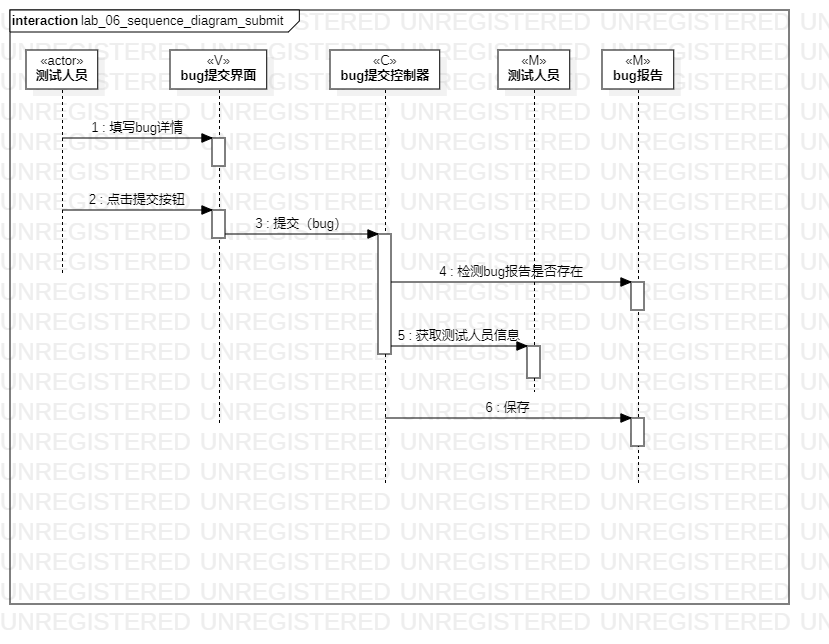
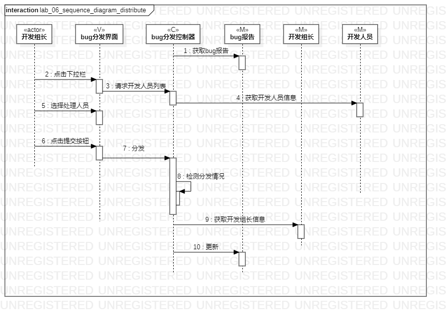
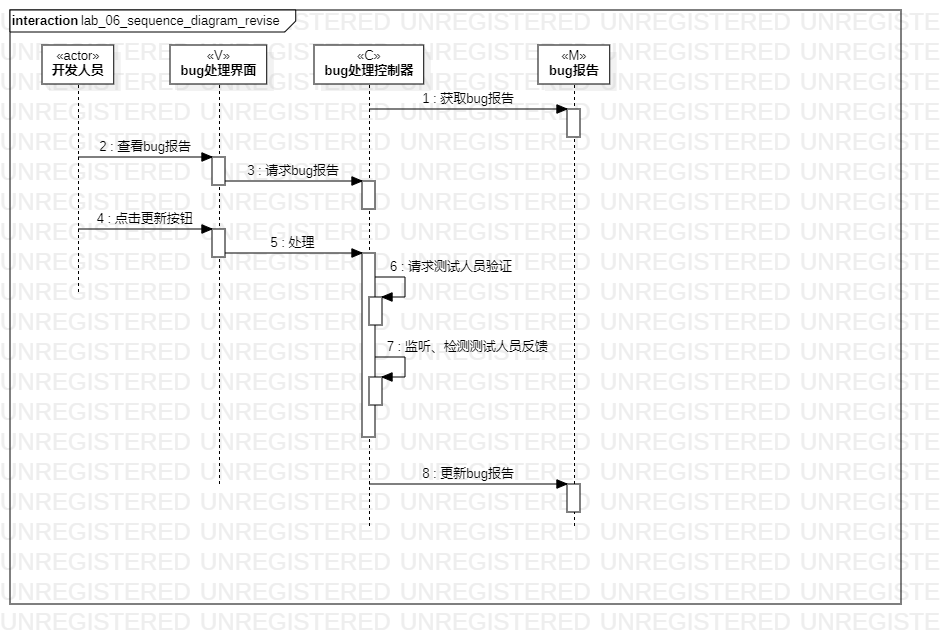

# 实验6：交互建模

## 一、实验目标

1. 掌握交互建模方法。

2. 掌握顺序图的画法。（Sequence Diagram）

## 二、实验内容

1. 根据用例规约图、活动图、用例图、类图创建顺序图

## 三、实验步骤

1. 画顺序图

2. 根据实验四、五确定对象，并添加Lifeline

3. 为每个Lifeline设置stereotype

4. 根据实验二、三确定消息，并添加message

5. 确定返回信息，添加reply message

## 四、实验结果

图1：提交顺序图

图2：分发顺序图

图3：处理顺序图