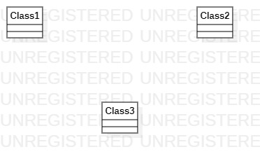

# 实验一

## 一、实验目标

1. 熟悉GitHub实验过程；
2. 安装与使用StarUML。

## 二、实验内容

1. 安装Github并练习使用Git Bash；
2. 安装StarUML并创建第一个图。

## 三、实验步骤

1.在StarUML上画图；
2.保存后上传到Github；
3.在实验一报告中引用。

## 四、实验结果

1. 画图

  图1. 在StarUML上创建的第一个图
