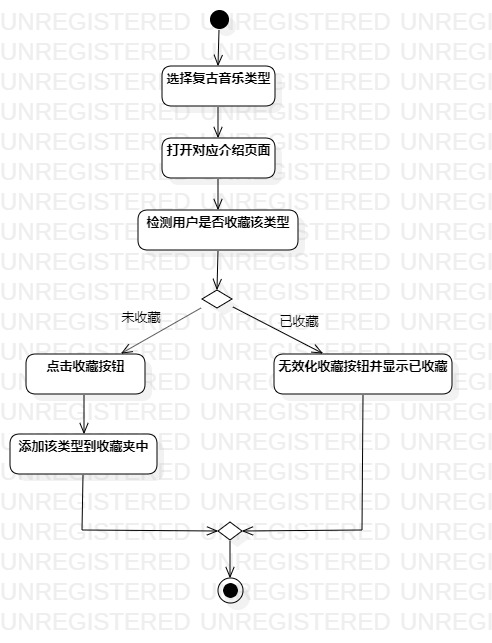
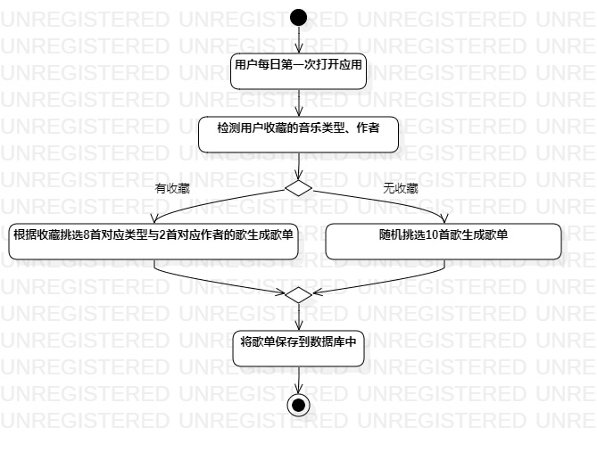

# 实验三：过程建模

## 一、实验目标

1、掌握过程建模方法  
2、掌握活动图的画法（Activity Diagram）

## 二、实验内容

1、画出活动图
2、在Pull Request中显示图片

## 二、实验步骤

1、确定用例：收藏复古音乐、每日生成推荐歌单  
2、对用例过程建模，并使用StarUML画出活动图  
3、编写实验报告并在Pull Request显示图片   

## 三、实验结果
  
  
图1. 收藏复古音乐的活动图

  
图2. 每日生成推荐歌单的活动图 
