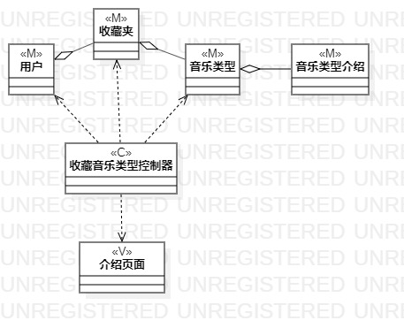
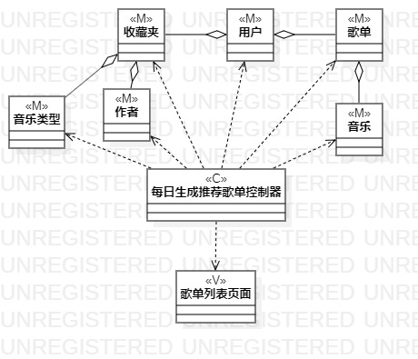

# 实验四：类建模\实验五：高级类建模

## 一、实验目标

1、掌握类建模方法   
2、了解MVC或你熟悉的设计模式   
3、掌握类图（Class Diagram）的画法   

## 二、实验内容

1、基于MVC模式设计类   
2、设计类的关系   
3、画出类图   

## 二、实验步骤

1、在用例规约中找出控制器、视图与模型类   
2、基于MVC模式设计类的关系   
3、在StarUML中画出类图   
4、编写实验报告并在Pull Request显示图片      

## 三、实验结果
  
  
图1. 收藏复古音乐的类图 

  
图2. 每日生成推荐歌单的类图 
