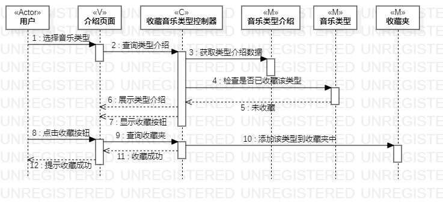

# 实验六：交互建模

## 一、实验目标

1、理解系统交互   
2、掌握UML顺序图的画法   
3、掌握对象交互的定义与建模方法   

## 二、实验内容

1、根据用例模型和类模型，确定功能所涉及的系统对象   
2、在顺序图上画出参与者（对象）   
3、在顺序图上画出消息（交互）   

## 二、实验步骤

1、在活动图和类图中找出参与者   
2、根据活动图和找到的参与者进行交互建模   
3、在StarUML中画出顺序图   
4、编写实验报告并在Pull Request显示图片      

## 三、实验结果
  
  
图1. 收藏复古音乐的顺序图  

  
图2. 每日生成推荐歌单的顺序图 
