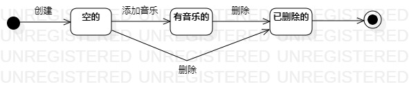

# 实验七：状态建模

## 一、实验目标

1、掌握对象状态建模（状态图，Statechart）      

## 二、实验内容

1、根据用例模型和类模型，确定功能所涉及的系统对象   
2、在顺序图上画出参与者（对象）   
3、在顺序图上画出消息（交互）   

## 二、实验步骤

1、在之前的活动图和类图中找出一个关键的对象   
2、设计该对象的状态、变换条件   
3、在StarUML中画出状态图   
4、编写实验报告并在Pull Request显示图片      

## 三、实验结果
  
  
图1. 歌单的状态图   
