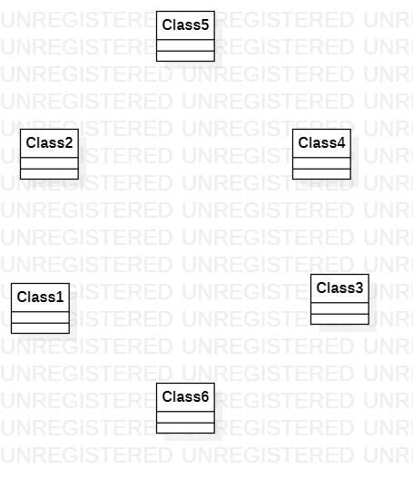

# 实验一：UML建模工具 #1

## 实验目标

1. 下载StarUML和Git
2. 注册git账号
3. 确认选题及其功能要求
4. 建立第一个UML模型图
5. 使用git上传本地使用文件
6. 在GitHup将git上的文件发送至老师账号

## 实验内容

下载并安装建模工具 StarUML，下载地址：http://staruml.io
确定个人建模选题，将选题填写在 Issues 中：
https://github.com/hzuapps/uml-modeling-2020/issues

## 实验步骤

网络上课期间按视频讲解步骤操作，包括：安装软件、加入GitHub库、创建实验报告。

## 实验结果

