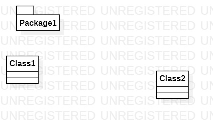

# 实验一

## 一、实验目的

1. 熟练Github的实验过程  
2. 安装与使用StartUML

## 二、实验内容

1. 安装GitHub并练习使用Git Bash  
2. 安装StartUML并创建第一个UML图

## 三、实验步骤

1. Fork项目  
2. 通过Github克隆项目到自己账号下的uml-modeling-2020  
3. 创建以学号命名的文件夹  
4. 打开StartUML并创建第一个UML图  
5. 保存创建的UML图放到学号文件夹下  
6. 把修改的内容git push到Github上  
7. 在GitHub上创建Lab1.md  
8. 导入UML图到lab1.md中  
9. Pull Request  
10. 把lab1.mdgit pull到本地

## 四、实验结果

  
图1. 在StartUML创建的第一个UML图
