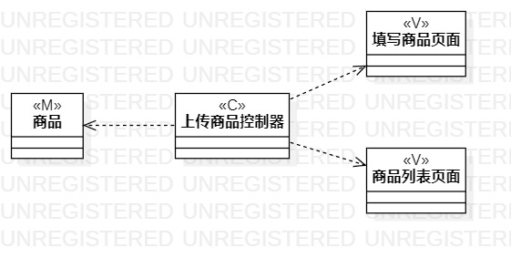
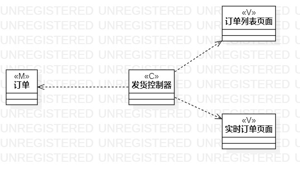

# 实验四:类建模
# 实验五:高级类建模

## 一、实验目标

1. 掌握类的概念和构成
2. 掌握类建模方法
3. 了解MVC设计模式
4. 掌握类图的画法

## 二、实验内容

1. 学习掌握类建模的方法
2. 学习MVC设计模式
3. 根据用例规约绘制相应的类图
4. 完成实验报告

## 三、实验步骤

1. 确定使用MVC设计模式
2. 通过用例规约找出类、页面还有控制器
3. 在StarUML中创建类图
4. 根据MVC设计模式确定类的关系
5. 撰写实验报告

## 四、实验结果
 
  
图1 卖家上架商品类图

  
图2 卖家发货类图

  
图3 买家下单类图
