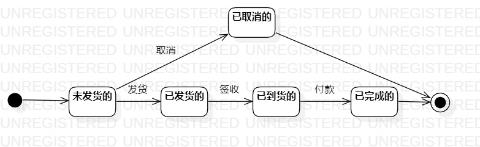

# 实验七:对象交互建模及顺序图

## 一、实验目标

掌握对象状态建模（状态图，Statediagram）。

## 二、实验内容

1. 分析系统，确定所涉及的系统对象；
2. 在状态图上画出对象的所有状态；
3. 在状态图上画出状态的变化条件；

## 三、实验步骤

1. 在StarUML中新建状态图，确定关键对象: 订单。
2. 结合以往实验找出订单的状态
3. 画出订单状态的变换动作和条件
4. 编写实验报告

## 四、实验结果  

  
订单状态图
