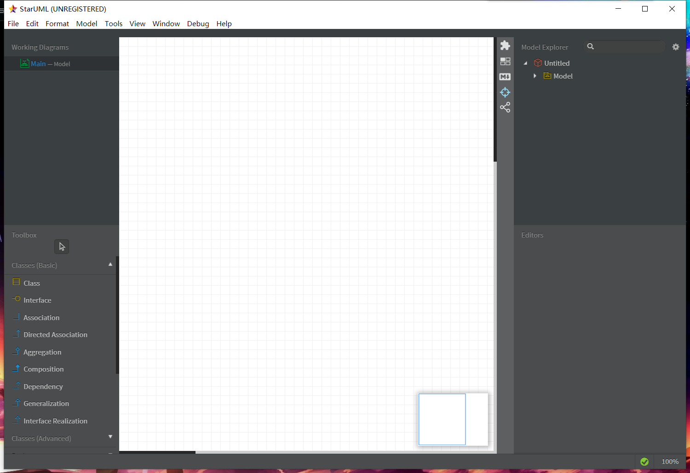
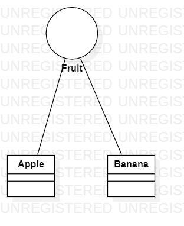

# 实验一

## 实验目标

- 下载StarUML和Git
- 注册git账户
- 确认选题及其功能要求
- 建立第一个UML模型图
- 使用git上传本地使用文件
- 在GitHub将git上的文件发送至老师账号

## 实验内容

## 选题标题：小E词汇

## 功能需求

上传word文档，提取并统计英文词汇数量，提供统计结果下载

### 功能1

上传word文档

### 功能2

统计英文单词

### 功能3

将数据库结果导出成文件下载

