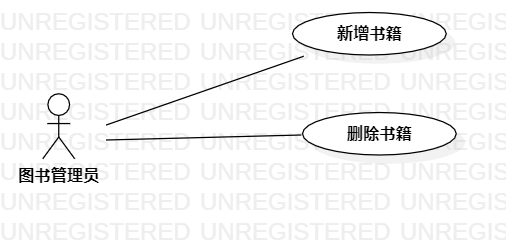

# 实验二：用例建模

## 一、实验目标

1. 使用Markdown编写报告
2. 细化选题
3. 学习使用StarUML用例建模

## 二、实验内容

1. 创建用例图
2. 编写实验报告文档
3. 编写用例规约

## 三、实验步骤

1. 选题定为图书管理系统
2. 确定系统的参与者与所有事件
3. 确定参与者（Actor）：
   - 图书管理员
4. 确定用例（UserCase）：
   - 新增书籍
   - 删除书籍
5. 建立Actor与UserCase之间的联系
6. 用StarUML绘制用例图（Lab2_UseCaseDiagram）
7. 编写用例规约

## 四、实验结果

1. 画图

  
图1：图书管理系统的用例图

## 表1：新增书籍用例规约

| 用例编号 | UC01                                                         | 备注               |
| -------- | ------------------------------------------------------------ | ------------------ |
| 用例名称 | 新增书籍                                                     |                    |
| 前置条件 | 图书管理员已经登录系统                                       | 可选               |
| 后置条件 | 系统返回”新增书籍成功“提示信息                               | 可选               |
| 基本流程 | 1. 图书管理员点击新增按钮；                                  | 用例执行成功的步骤 |
| ~        | 2. 系统弹出书籍信息表单；                                    |                    |
| ~        | 3. 图书管理员填写书籍信息和数量，点击保存按钮；              |                    |
| ~        | 4. 系统查询书籍信息，检查未存在相同书籍，保存书籍信息和数量； |                    |
| ~        | 5. 系统返回“新增书籍成功”提示信息；                          |                    |
| 拓展流程 | 4.1 系统检查发现书籍信息已经存在，提示图书管理员“书籍已经存在，无法新增”。 | 用例执行失败       |

## 表2：删除书籍用例规约

| 用例编号 | UC02                                                         | 备注               |
| -------- | ------------------------------------------------------------ | ------------------ |
| 用例名称 | 删除书籍                                                     |                    |
| 前置条件 | 图书管理员已经登录系统，在书籍列表页面                       | 可选               |
| 后置条件 | 系统返回”删除书籍成功“提示信息                               | 可选               |
| 基本流程 | 1. 图书管理员选中一条书籍记录，点击记录最后边的删除按钮；    | 用例执行成功的步骤 |
| ~        | 2. 系统查询所选书籍存在，标记借出书籍；                      |                    |
| ~        | 3. 系统返回“删除书籍成功”提示信息；                          |                    |
| 拓展流程 | 2.1 系统查询所选书籍不存在，返回“信息错误，请刷新页面”提示信息。 | 用例执行失败       |

