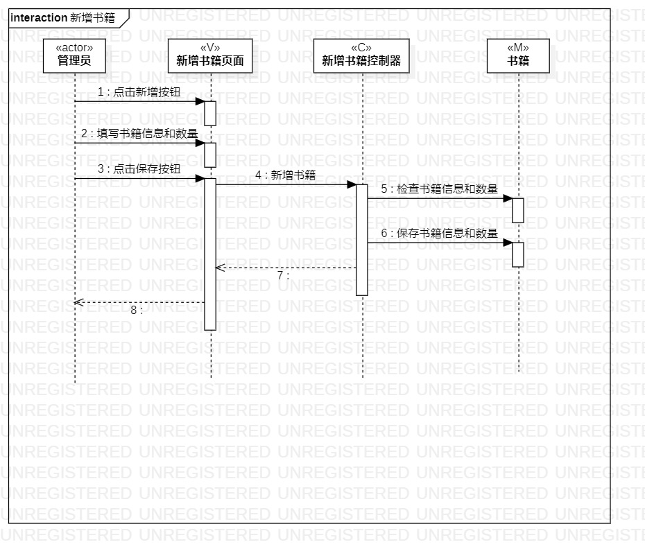
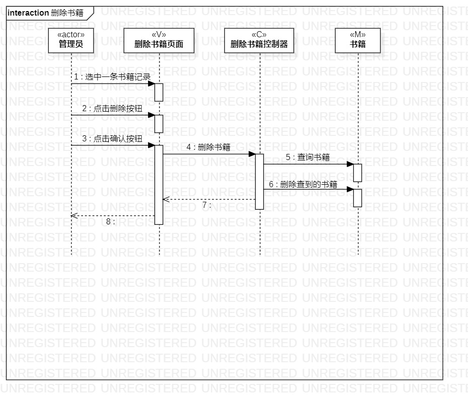

# 实验六：交互建模

## 一、实验目标

1. 理解系统交互；
2. 掌握UML顺序图的画法；
3. 掌握对象交互的定义与建模方法。

## 二、实验内容

1. 根据用例图和类图，确定系统内部对象和外部对象（actor）；
2. 创建时序图（Sequence Diagram）；
3. 在时序图上画出系统对象
4. 在时序图上画出消息（message）。

## 三、实验步骤

1. 确定系统对象
   1. 新增书籍
      - 管理员（actor）
      - 新增书籍页面（Model）
      - 新增书籍控制器（Controller）
      - 书籍（View）
   2. 删除书籍
      - 管理员（actor）
      - 删除书籍页面（Model）
      - 删除书籍控制器（Controller）
      - 书籍（View）
2. 创建时序图（Sequence Diagram）
3. 画出系统对象
4. 画出消息（message）

## 四、实验结果

  图1.新增书籍时序图

  图2.删除书籍时序图

