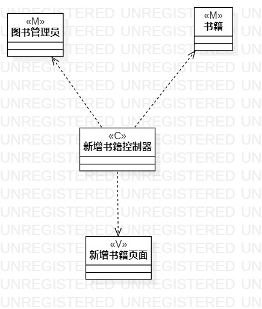
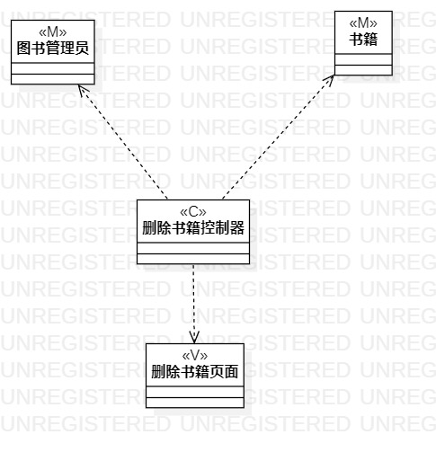

# 实验四五：类图

## 一、实验目标

1. 掌握类建模方法；
2. 了解MVC或你熟悉的设计模式；
3. 掌握类图的画法；（Class Diagram）
4. 理解类的5种关系；
5. 掌握类之间关系的画法。（Class Diagram）

## 二、实验内容

1. 选择熟悉的设计模式：MVC设计模式
2. 分析类之间的关系；
3. 画出类图
4. 检查类图正确性

## 三、实验步骤

1. 选择熟悉的设计模式：MVC设计模式
2. 分析类之间的关系
   1. 新增书籍
      - 图书管理员（model）
      - 书籍（model）
      - 新增书籍控制器（controller）
      - 新增书籍页面（view）
   2. 删除书籍
      - 图书管理员（model）
      - 书籍（model）
      - 删除书籍控制器（controller）
      - 删除书籍页面（view）
3. 画出类图
4. 检查类图正确性

## 四、实验结果

  图1.新增书籍类图

  图2.删除书籍类图