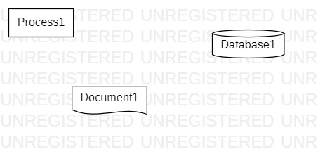

# 实验一

## 一、实验目标
1. 学会使用StarUML建模工具
2. 学会使用GitBash工具
## 二、实验内容
1. 安装和使用StarUML和GitBash
2. 创建并提交第一个建模文档
## 三、实验步骤

1. Fork项目到自己github账号
2. 把项目克隆到本地
3. 在本地创建文件夹及文件
4. 创建模型并导出为图片
5. 将文件夹提交到github
6. 发送Request到主项目库

## 四、实验结果

