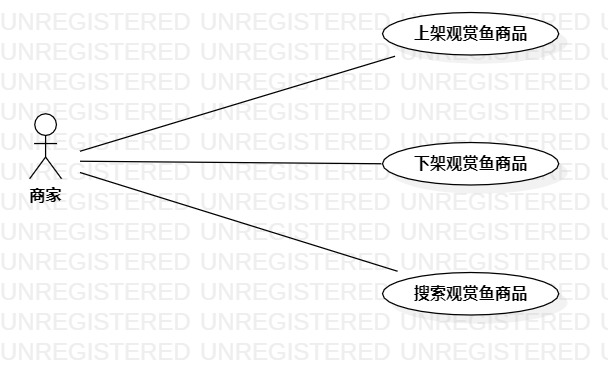

# 实验二：用例建模

## 一、实验目标

1. 选好题目
2. 完成用例建模
3. 完成实验报告

## 二、实验内容

1. 自主选题
2. 使用StartUML进行用例建模
3. 根据用例图编写用例规约

## 三、实验步骤

1. 在StartUML中创建Use case Diagram

2. 根据选题画出用例图

   - 确定参与者（Actor）：
     - 商家

   - 确定用例（Use Case）：
      - 上架观赏鱼商品
      - 下架观赏鱼商品
      - 搜索观赏鱼商品

3. 画完导出用例图

4. 在实验报告中根据用例图编写用例规约

## 四、实验结果

图1：观赏鱼批发管理系统用例图

## 表1：上架观赏鱼商品用例规约  

用例编号  | UC01 | 备注  
-|:-|-  
用例名称  | 上架观赏鱼商品  |   
前置条件  | 商家登录进入观赏鱼批发管理系统     |    
后置条件  | 商家进入观赏鱼批发管理系统首页     |    
基本流程  | 1. 商家点击上架商品按钮；  |    
~| 2. 系统显示上架观赏鱼商品页面；  |   
~| 3. 商家输入要上架的观赏鱼商品名称，单价和库存量，再点击上架按钮；  |   
~| 4. 系统检查发现观赏鱼商品名称，单价和库存量均不为空，且未存在相同的观赏鱼商品名称或已存在但为下架状态，确认该商品可以上架，修改为上架状态，保存该商品的信息；  |   
~| 5. 系统显示首页。  |  
扩展流程  | 4.1 系统检查发现观赏鱼商品名称，单价和库存量有一项及以上为空，提示“所有信息不能为空”；  |    
~| 4.2 系统检查发现该商品名称已存在且为上架状态，提示“该商品已经上架，上架失败”。  |  

## 表2：下架观赏鱼商品用例规约  

用例编号  | UC02 | 备注  
-|:-|-  
用例名称  | 下架观赏鱼商品  |   
前置条件  | 商家登录进入观赏鱼批发管理系统     |    
后置条件  | 商家进入观赏鱼批发管理系统首页     |    
基本流程  | 1. 商家点击某一观赏鱼商品栏的下架按钮；  |    
~| 2. 系统发出再次确认下架的对话框；  |   
~| 3. 商家确认点击“是”按钮；  |   
~| 4. 系统检查发现该商品库存量小于100，修改商品为下架状态，并显示“商品下架成功”；  |   
~| 5. 系统显示首页。  |  
扩展流程  | 4.1 系统检查发现该商品库存量大于100，提示“该商品库存量较大，下架失败”。  |    

## 表3：搜索观赏鱼商品用例规约  

用例编号  | UC03 | 备注  
-|:-|-  
用例名称  | 搜索观赏鱼商品  |   
前置条件  | 商家登录进入观赏鱼批发管理系统     |    
后置条件  | 商家进入观赏鱼批发管理系统首页     |    
基本流程  | 1. 商家点击搜索文本框，输入观赏鱼商品名称，并点击搜索按钮；  |    
~| 2. 系统检查发现观赏鱼商品名称不为空，搜索商品信息；  |   
~| 3. 系统显示搜索结果信息页面。  |   
扩展流程  | 2.1 系统检查发现观赏鱼商品名称为空，提示“商品名称不能为空”。  |    

