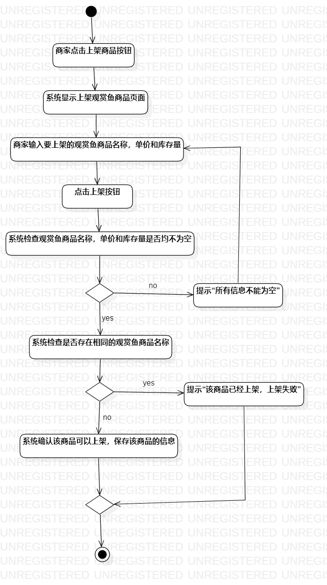
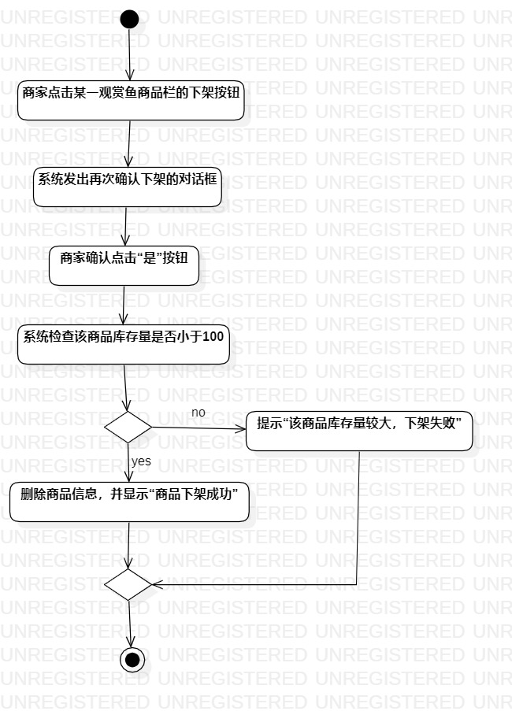
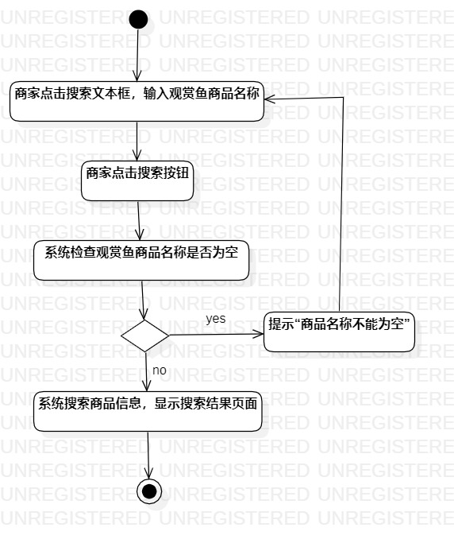

# 实验三   过程建模
## 一、实验目标

1. 掌握过程建模方法；
2. 掌握UML中活动图（Activity Diagram）的画法。

## 二、实验内容
1. 观看视频学习过程建模方法；  
2. 使用StarUML画出活动图；  
3. 使用Markdown编写实验报告。  

## 三、实验步骤  
1.在StarUML创建三个活动图（Activity Diagram）：  
（1）上架观赏鱼商品活动图；  
（2）下架观赏鱼商品活动图；
（3）搜索观赏鱼商品活动图。
2.每个活动图中添加Initial节点。  
3.根据用例规约画图：  
（1）使用Action图形画出基本流程和扩展流程；  
（2）使用（Decision）节点画出分支操作；
（3）使用（Merge）节点画出合并操作。 
4.全部画完都补上Final节点。 

## 四、实验结果

  
图1 上架观赏鱼商品活动图

  
图2 下架观赏鱼商品活动图

  
图3 搜索观赏鱼商品活动图