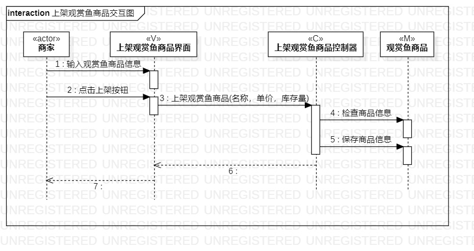
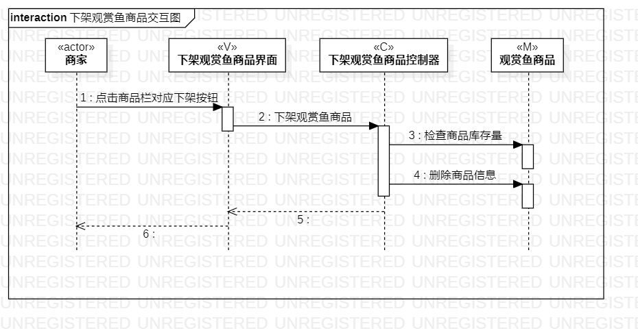

# 实验六   交互建模
## 一、实验目标

1. 掌握交互建模方法；
2. 掌握UML中交互图（Sequence Diagram）的画法；
3. 理解对象交互概念。

## 二、实验内容
1. 学习类交互图的基本概念；
2. 在bilibili观看视频学习交互建模方法；  
2. 根据活动图和类图使用StarUML画交互图。

## 三、实验步骤  
1. 在bilibili观看实验四五类建模视频；
2. 在StarUML创建三个交互图（Sequence Diagram）：  
（1）上架观赏鱼商品交互图；  
（2）下架观赏鱼商品交互图；
（3）搜索观赏鱼商品交互图。
3. 根据活动图和类图画交互图：  
（1）根据N+1使用Lifeline画出actor、Model、Controller和View；  
（2）使用Message表示交互的信息；
（3）使用Reply Message表示返回的信息。
4. 分别导出各交互图的JPEG格式图片；
5. 编写lab6.md实验报告文档。

## 四、实验结果

  
图1 上架观赏鱼商品交互图

  
图2 下架观赏鱼商品交互图

  
图3 搜索观赏鱼商品交互图

## 五、实验收获
交互图的概念与交互建模用途：
    （1）交互图描述对象之间的动态合作关系以及合作过程中的行为次序。
    （2）交互图常常用来描述一个用例的行为，显示该用例中所涉及的对象以及这些对象之间的消息传递情况，即一个用例的实现过程。
    （3）交互模型是用来描述系统内部的交互，是跨越了许多对象的整体行为视图。
    （4）同时了解对象、时序图、生命线和消息等概念在交互图的用法。

