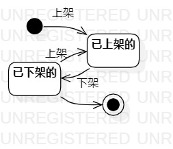

# 实验七   状态建模
## 一、实验目标

1. 掌握状态建模方法；
2. 掌握UML中状态图（Statechart Diagram）的画法。

## 二、实验内容
1. 观看视频学习状态建模方法；  
2. 使用StarUML画出状态图；  
3. 使用Markdown编写实验报告。  

## 三、实验步骤  
1. 在StarUML创建观赏鱼商品状态图；
2. 添加Initial节点；
3. 添加两个状态：
   （1）已上架的；
   （2）已下架的。
4. 画完状态转换，补上Final节点。 

## 四、实验结果

  
图1 观赏鱼商品状态图

## 五、注意事项
1. 寻找一个关键的对象；
2. 设计该对象的关键状态；
3. 对象的状态是：对象所表示的数据。如果数据发生变化，状态就是发生变化。
4. 描述状态：形容词。
5. 整个状态图都是在描述一个对象。
