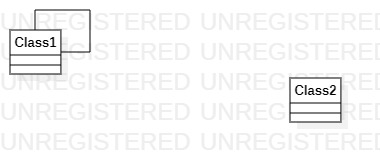

# 实验一

## 一、实验目标

### 1. 熟悉GitHub；
### 2. 安装StarUML。

## 二、实验内容

### 1. 安装运行GitBash并完成本地创库；
### 2. 运行StarUML完成第一次作图。

## 三、实验步骤

### 1. 在GitHub点击Fork加入课程的库；
### 2. 在Git Bash上克隆自己的账号并在本地创建自己的文件夹；
### 3. 在StarUML上使用工具画第一张图并导出在本地文件夹；
### 4. 使用Git Bash将自己的图push到自己GitHub的库；
### 5. 在GitHub上完成实验报告并pull request。

## 四、实验结果

