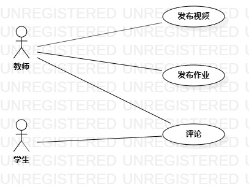

# 实验二：用例建模

## 一、实验目标

1. 使用Markdown编写报告
2. 细化选题
3. 学习使用StarUML用例建模

## 二、实验内容

1. 创建用例图
2. 编写实验报告文档
3. 编写用例规约

## 三、实验步骤

1. 选题定为教师网上授课系统
2. 确定系统的参与者与所有用例
3. 确定系统参与者（Actor）：
   - 教师
4. 确定用例（UserCase）：
   - 发布视频
   - 发布作业
   - 发布评论
5. 建立Actor与UserCase之间的联系
6. 绘制用例图（lab2_UseCaseDiagram）
7. 编写用例规约

## 四、实验结果

  
图1：教师网上授课系统的用例图

## 表1: 发布视频用例规约

| 用例编号  | UC01                                     | 备注                 |
| --------- | :--------------------------------------- | -------------------- |
| 用例名称  | 发布视频                                     |                      |
| 前置条件  | 教师进入网上授课系统                     | 可选                 |
| 后置条件  |                      | 可选                 |
| 基本流程  | 1. 教师点击发布视频按钮; | *用例执行成功的步骤* |
| ~         | 2. 系统显示选择发布视频页面;         |                      |
| ~         | 3. 教师选择要发布的视频,点击确定按钮;                      |                      |
| ~         | 4. 系统检查本地文件存在该视频文件;                 |                      |
| ~         | 5. 系统检查视频命名不为空,不含特殊字符;                       |                      |
| ~         | 6. 系统保存视频信息,提示"发布成功";                 |                      |
| ~         | 7. 系统显示已发布视频列表页面                 |                      |
| 扩展流程1 | 4.1 系统检查该文件不存在,提示"该视频不存在";       | 用例执行失败         |
| ~         | 5.1 系统检查视频命名为空或包含特殊字符,提示"视频命名不合法，请重新输入"                 |                      |

## 表2: 发布作业用例规约

| 用例编号  | UC02                                     | 备注                 |
| --------- | :--------------------------------------- | -------------------- |
| 用例名称  | 发布作业                                     |                      |
| 前置条件  | 教师进入网上授课系统                       | 可选                 |
| 后置条件  |                      | 可选                 |
| 基本流程  | 1. 教师点击发布作业按钮; | *用例执行成功的步骤* |
| ~         | 2. 系统显示选择发布作业页面;         |                      |
| ~         | 3. 教师在线编辑要发布的作业文件;                      |                      |
| ~         | 4. 教师选择作业完成截止时间,点击确定发布按钮;                 |                      |
| ~         | 5. 系统检查作业的内容输入不为空;                |                      |
| ~         | 6. 系统检查作业文件命名不为空,不包含特殊字符;                      |                      |
| ~         | 7. 系统保存作业信息,提示"发布成功";                 |                      |
| ~         | 8. 系统显示已发布作业列表页面                 |                      |
| 扩展流程1 | 5.1 系统检查作业文件的内容为空,提示"请输入作业内容";       | 用例执行失败         |
| ~         | 6.1 系统检查作业文件命名为空或包含特殊字符,提示"作业命名不合法，请重新输入"                 |                      |

## 表3: 查看评论用例规约

| 用例编号  | UC03                                     | 备注                 |
| --------- | :--------------------------------------- | -------------------- |
| 用例名称  | 发布评论                                     |                      |
| 前置条件  | 教师进入网上授课系统                      | 可选                 |
| 后置条件  |                      | 可选                 |
| 基本流程  | 1. 教师点击查看评论按钮; | *用例执行成功的步骤* |
| ~         | 2. 系统显示该视频的评论页面;         |                      |
| ~         | 3. 教师查看视频评论页面;                      |                      |
| ~         | 4. 教师点击要回复的评论;                 |                      |
| ~         | 5. 系统显示回复文本框;                |                      |
| ~         | 6. 教师输入回复内容,点击发布按钮;                      |                      |
| ~         | 7. 系统检查回复内容不为空;                      |                      |
| ~         | 8. 系统保存回复信息,提示"回复成功";                 |                      |
| ~         | 9. 系统显示视频评论页面                 |                      |
| 扩展流程1 | 7.1 系统检查回复的内容为空,提示"请输入回复内容";       | 用例执行失败         |

