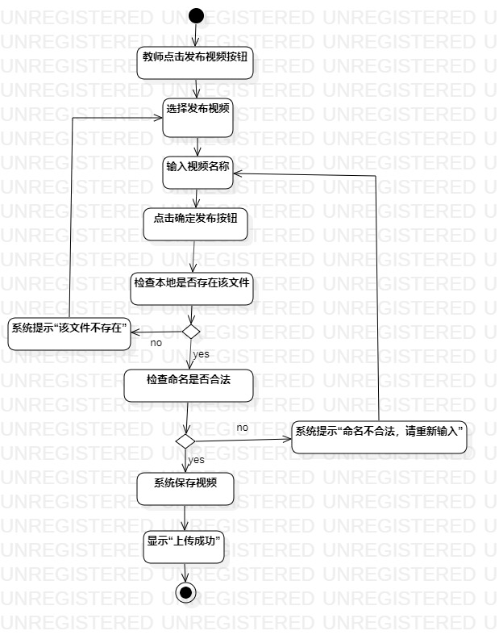
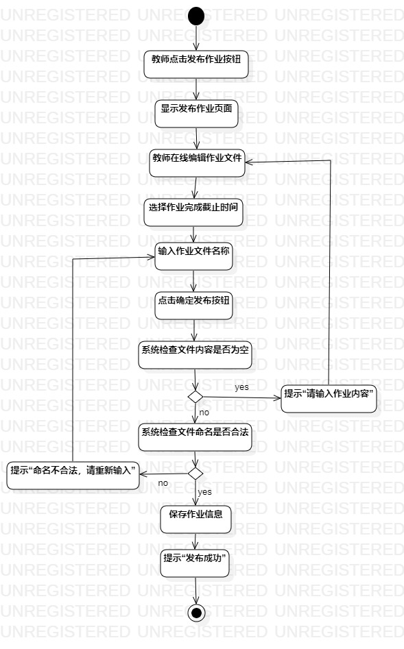
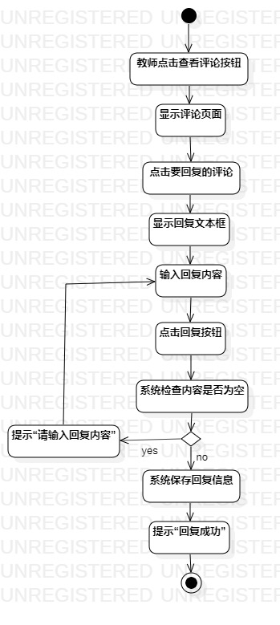

# 实验三：过程建模

## 一.实验目标

1. 掌握过程建模方法
2. 掌握活动图的画法

## 二.实验内容

根据实验二中的用例规约创建活动图

## 三.实验步骤

1. 观看老师视频，熟悉活动图（Activity Diagram）的符号及其用法
2. 在StarUML创建Activity Diagram
3. 添加Initial结点
4. 根据用例规约添加Action和Decision
5. 最后用Control Flow将各符号连接
6. 添加Final结点
7. 调节符号之间的间距和比例，完善活动图

## 四.实验结果
  
图1：教师发布视频活动图  
   
图2：教师发布作业活动图  
   
图3：教师发布评论活动图  
