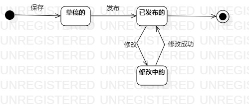

# 实验七：状态建模

## 一、实验目标

1. 掌握对象状态建模（状态图，Statechart）。

2. 掌握UML状态图的画法。 

3. 掌握对象状态的定义与建模方法。 

## 二、实验内容

1. 根据用例规约、类图、状态图、顺序图来画关键对象的状态图；

2. 设计该对象的关键状态；

3. 设计状态之间的转变条件。

## 三、实验步骤

1. 找出关键的对象；
   - 教师发布视频的一个属性：视频信息
   
2. 设计该对象的关键状态（用Simple State表示）
   - 草稿的
   - 已发布的
   - 修改中的
   
3. 设计状态之间的转变条件

4. 用StarUML画出该对象的状态图（StatechartDiagram）
   - Add - Statechart

## 四、实验结果

  
图1：教学视频状态图
