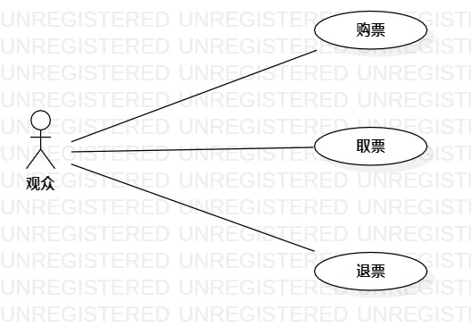

# 实验二：用例建模

## 1. 实验目标

- 创建并完善选题
- 学习并掌握StarUML的画图的操作方法

## 2. 实验内容

- 建立个人选题
- 根据自己的选题使用StarUML工具绘制用例图
- 编写用例规范

## 3. 实验步骤

1.确立系统的用例
- 购票
- 取票
- 退票

2.确立系统的参与者
-票务操作员
-观众

3.建立参与者与用例的联系

## 4. 实验结果

图1：影院售票管理系统的用例图

## 表1：购票用例规约  

用例编号  | UC01 | 备注  
-|:-|-  
用例名称  | 购票  |   
前置条件  |  票务管理员设置开始出售某场次的影票   | *可选*   
后置条件  |      | *可选*   
基本流程  | 1.观众点击购票链接   |*用例执行成功的步骤*    
~| 2. 系统显示购票页面。 |   
~| 3. 观众选择电影名，场次和座位号，点击购票按钮。 |   
~| 4. 系统查询观众选择的信息，检查该票尚未出售,提示观众支付票价。 |   
~| 5.  观众成功支付，系统记录购买者信息，并将此票的状态更改为“已售”，并提示 **『购买成功』** 并发送二维码票据供观众取票。|  
扩展流程  | 3.1 系统检查发现此票已售出，**提示『此票已售出，请重新选票』**。  |*用例执行失败*    
~| 4.1 观众未及时支付。**提示『由于您未及时支付，请重新购票』**。 | 

## 表2：取票用例规约  

用例编号  | UC02 | 备注  
-|:-|-  
用例名称  | 取票  |   
前置条件  |  观众已购票   | *可选*   
后置条件  |      | *可选*   
基本流程  | 1.观众点击取票按钮。   |*用例执行成功的步骤*    
~| 2. 系统扫描观众提供的二维码票据。 |   
~| 3. 系统查询票据信息，检查票据与系统数据相匹配，系统打印影票，并提示 **『请及时取走您的票』**。 |   
扩展流程  | 3.1 系统检查发现票据与系统数据不符。提示 **『票据信息不匹配，请检查票据是否正确』**。 |*用例执行失败*    

## 表3：退票用例规约  

用例编号  | UC03 | 备注  
-|:-|-  
用例名称  | 退票  |   
前置条件  |  观众已购票   | *可选*   
后置条件  |      | *可选*   
基本流程  | 1.观众点击退票链接。   |*用例执行成功的步骤*    
~| 2. 系统查询满足退票时间范围。 |   
~| 3. 系统查询票据信息与系统数据相匹配，系统更改此票状态为“待出售”。 |   
~| 4. 系统记录退票操作员、退票日期、退票时间、退票金额。|   
~| 5. 系统退款。提示 **『退款成功』**|  
扩展流程  | 2.1 系统检查发现超出退票时间范围，提示 **『已超出退票时间，无法退票』**。  |*用例执行失败*    
~| 3.1 系统检查发现票据信息与系统数据不符，提示 **『票据信息不匹配，请检查票据是否正确』**。  |   
