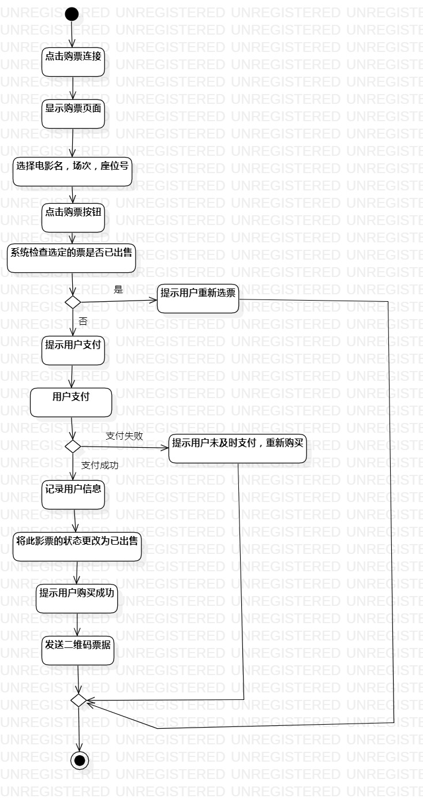
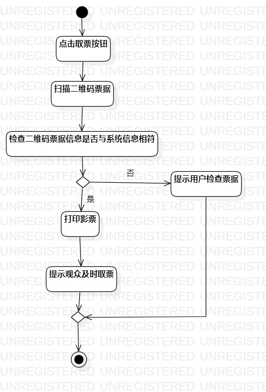
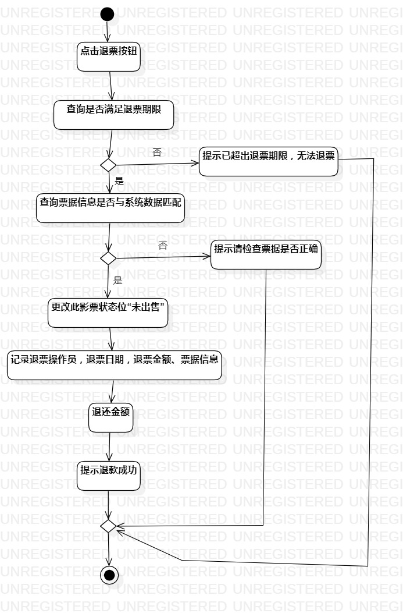

# 实验三：过程建模

## 1. 实验目标

- 掌握过程建模的方法

- 掌握活动图（Activity Diagram）的画法

## 2. 实验内容

- 学习过程建模的方法

- 根据实验二的用例规约绘制活动图

## 3. 实验步骤

1.学习starUML中各个图标的含义和用法

2.根据购票用例规约绘制该用例的活动图

3.根据取票用例规约绘制该用例的活动图

4.根据售票用例规约绘制该用例的活动图

## 4. 实验结果

图1：影院售票管理系统的购票活动图

图2：影院售票管理系统的取票活动图

图3：影院售票管理系统的退票活动图

