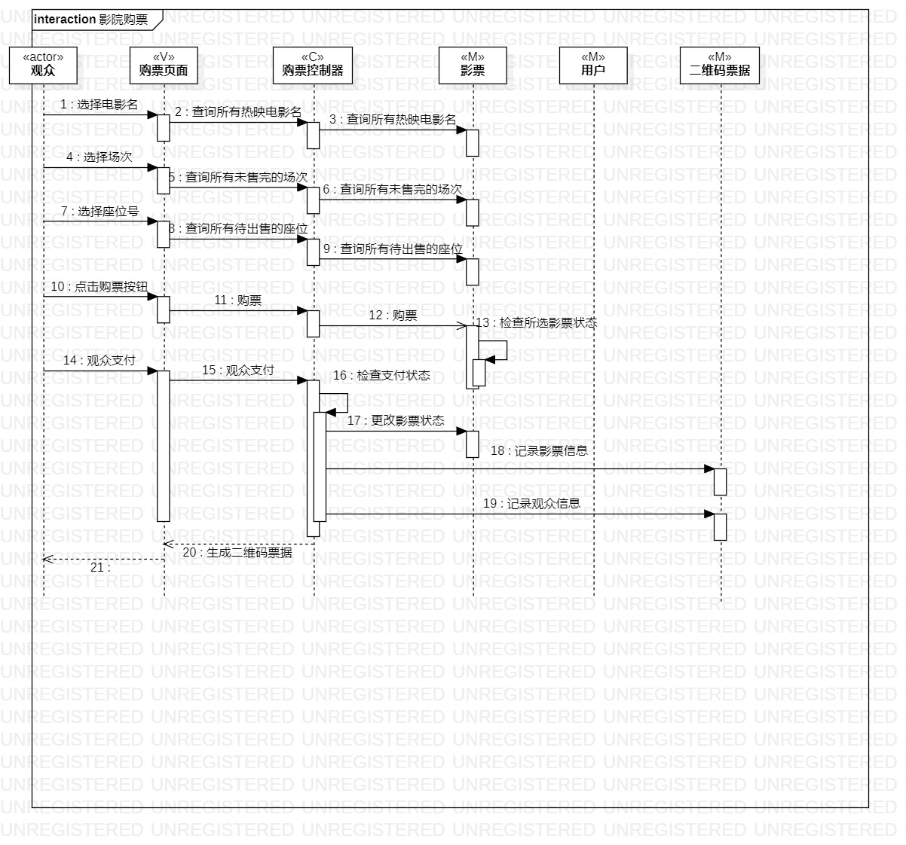
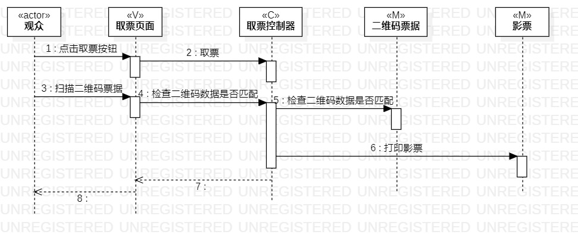
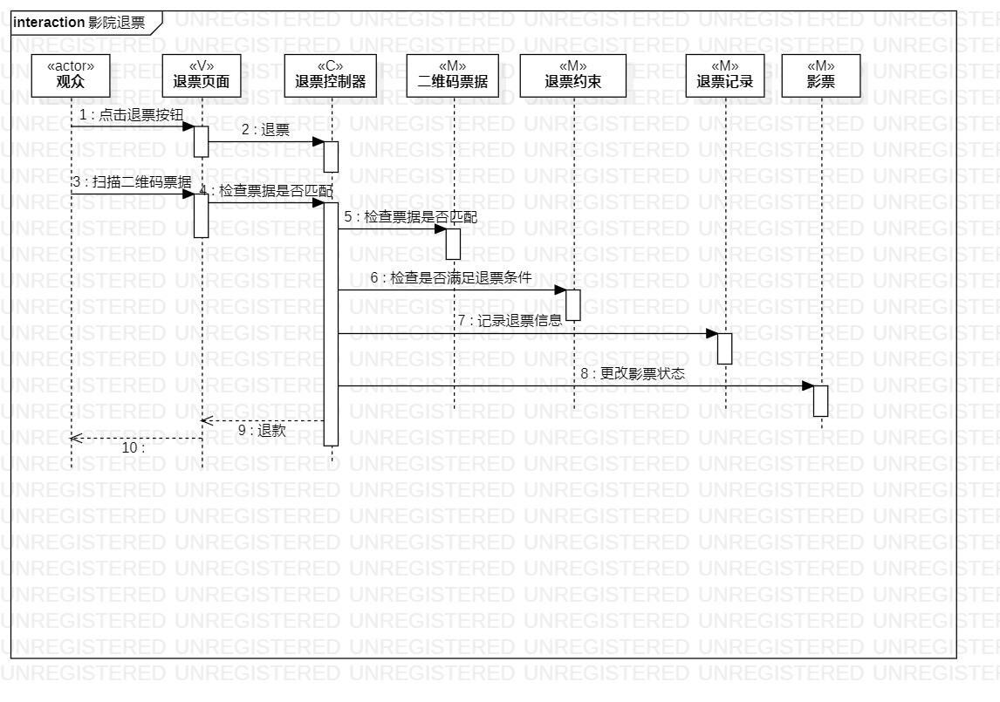

# 实验六：交互建模

## 1.实验目标
1. 理解系统交互；
2. 掌握UML顺序图的画法；
3. 掌握对象交互的定义与建模方法。

## 2. 实验内容
1. 根据用例模型和类模型，确定功能所涉及的系统对象；
2. 在顺序图上画出参与者（对象）；
3. 在顺序图上画出消息（交互）；

## 3. 实验步骤
1. 了解对象以及其画法；
2. 了解顺序图的构成、“时间顺序”的概念；
3. 了解顺序图的对象交互以及参与者的存活条；
4. 了解各种箭头对应的消息类型；
5. 从类图中找到以下参与者：
   #### 1. 影院购票
   观众（a）、购票页面（v）、购票控制器（c）、用户（m）、影票（m）、二维码票据（m）；
   #### 2. 影院取票
   观众（a）、取票页面（v）、取票控制器（c）、二维码票据（m）、影票（m）；
   #### 3. 影院退票
   观众（a）、退票页面（v）、退票控制器（c）、二维码票据（m）、退票约束（m）、退票记录（m）、影票（m）；

6. 从活动图中提取出步骤；

## 4. 实验结果

  
图1：影院购票的顺序图

  
图2：影院取票的顺序图

  
图3：影院退票的顺序图