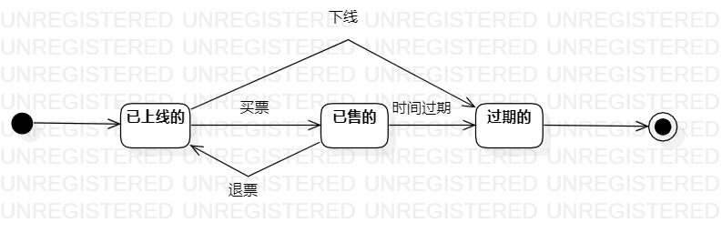

# 实验七：状态建模

 ## 实验目标

1.  掌握对象状态建模（状态图，Statechart）。

 ## 实验内容

1.  寻找一个关键的对象；  
2.  设计该对象的关键状态；  
    （1） 对象的状态是：对象所表示的数据。如果数据发生变化，状态就是发生变化。  
    （2） 描述状态：形容词。  
    （3） 电影票： 已上线的、已售的、过期的。
3.  设计状态之间的转变条件。

 ## 实验步骤

1. 新建状态图模型，寻找1个重要的对象命名状态图；
2. 寻找这个对象的所有重要状态；
3. 状态命名用形容词，合并相同的状态；
4. 画出状态之间的转变条件。

 ## 实验结果

   
图1：电影票的状态图