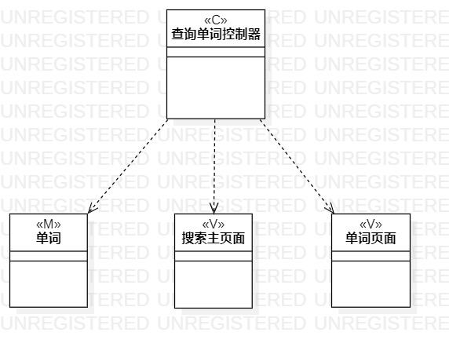
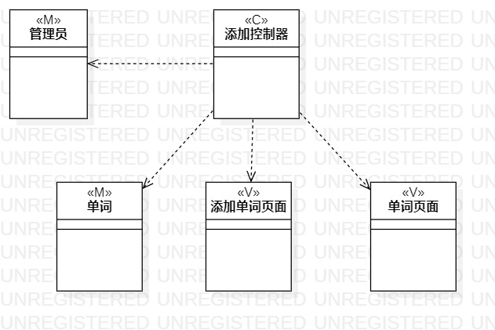

# 实验四、五：类建模与高级类建模

## 一、实验目标

1. 掌握类建模方法；

2. 了解MVC设计模式；

3. 掌握类的五种关系；

4. 掌握类图的画法。

## 二、实验内容

1. 基于MVC模式设计类；

2. 设计类的关系；

3. 画出类图。

## 三、实验步骤

1. 在用例规约表中寻找类、视图和控制器。

2. 根据“查询单词”用例，设计出  

 * Model：单词类；

 * View：主页面， 单词页面；

 * Control：查询单词控制器。  
 
3. 根据“添加单词”用例，设计出  

 * Model：单词类；

 * View：添加单词页面；

 * Control：添加单词控制器。  

4. 根据“修改单词描述”用例，设计出  

 * Model：单词类；

 * View：单词页面；

 * Control：修改单词描述控制器。  
 
5. 创建类之间的依赖关系，判断该类不需要包含关系  

6. 完成makedown文件

## 四、实验结果

  
图1：查询单词类图

  
图2：添加单词类图  

  
图3：修改单词描述类图  
