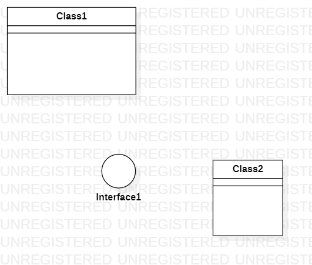

# 实验一

## 一、实验目标

1.安装建模工具 StarUML  
2.确认个人建模选题  

## 二、实验内容

1.安装GIT  
2.FORK项目，完成作业  
3.提交

## 三、实验步骤

1.下载安装StarUML  
2.安装git  
3.fork、使用gitclone项目  
4.创建UML图  
5.将图、markdown上传至个人库  
6.请求合并

## 四、实验结果

1. 画图  
  
图1. StartUML创建第一张图
