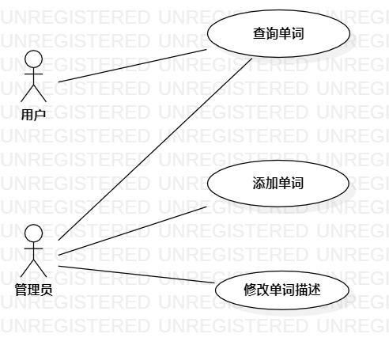

# 实验二

## 一、实验目标

1.学习UML用例图  
2.弄明白用例文档表，一些主要表项的意义  

## 二、实验内容

1.画出自己所选题目的用例图  
2.填写自己的用例文档表  

## 三、实验步骤

1.想清楚自己选择题目的参与者是：用户、管理员  
2.区分参与者的功能  
&ensp;&ensp;&ensp;&ensp;管理员：    
&ensp;&ensp;&ensp;&ensp;&ensp;&ensp;&ensp;&ensp;(1.添加单词   
&ensp;&ensp;&ensp;&ensp;&ensp;&ensp;&ensp;&ensp;(2.修改单词描述

&ensp;&ensp;&ensp;&ensp;用户：  
&ensp;&ensp;&ensp;&ensp;&ensp;&ensp;&ensp;&ensp;(1.查询单词  
3.确定对应功能的页面有主页面，单词页面，添加单词页面。  
4.区分参与者的区别：管理员登陆成功后单词页面会多出修改按钮，只有管理者可以进入添加单词页面。

## 四、实验结果

1. 画图  
  
图1. StartUML创建用例图  
## 表1：查询单词用例规约  

用例编号  | UC01 | 备注  
-|:-|-  
用例名称  | 查询单词  |   
前置条件  |用户在主页面  | *可选*   
后置条件  |      | *可选*   
基本流程  | 1.用户输入单词  |*用例执行成功*  
~| 2. 用户点击搜索按钮。  |   
~| 3. 系统查询到该单词，返回该单词的详细信息。  |   
~| 4.用户跳转到该单词的单词页面。  |    
扩展流程  | 3.1. 系统未查询到该单词，提示没有找到该单词。  |*用例执行失败*        

## 表2：添加单词用例规约  

用例编号  | UC02 | 备注  
-|:-|-  
用例名称  | 添加单词  |   
前置条件  |管理员在添加单词页面;管理员登录成功  | *可选*   
后置条件  |      | *可选*   
基本流程  ~| 1. 管理员输入单词。  |*用例执行成功*    
~| 2. 管理员点击添加按钮。  |   
~| 3. 系统判断输入非空。 |   
~| 4. 系统查询到该单词，保存单词单词，提示添加成功。 |   
扩展流程  | 3.1. 系统判断输入为空，提示没有输入单词。 |*用例执行失败*  
~| 4.1. 系统判断输入非空，查询到该单词，单词已存在。  |  *用例执行失败*  

## 表3：修改单词描述用例规约  

用例编号  | UC03 | 备注  
-|:-|-  
用例名称  | 修改单词描述  |   
前置条件  |管理员在单词页面;管理员登录成功  | *可选*   
后置条件  |      | *可选*   
基本流程  | 1. 管理员修改单词描述。  |*用例执行成功*    
~| 2. 管理员点击上传按钮。  |   
~| 3. 系统修改单词描述信息，提示修改成功。 |   
~| 4. 管理员重新跳转至该单词页面。  | 

