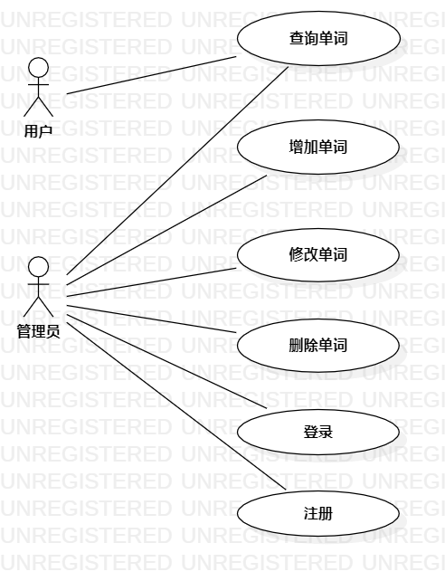

# 实验二

## 一、实验目标

1.学习UML用例图  
2.弄明白用例文档表，一些主要表项的意义  

## 二、实验内容

1.画出自己所选题目的用例图  
2.填写自己的用例文档表  

## 三、实验步骤

1.想清楚自己选择题目的参与者是：用户、管理员  
2.区分参与者的功能  
  管理员：    
    (1.登录  
    (2.查询单词  
    (3.修改单词  
    (4.删除单词  
    (5.添加单词  
  用户：  
    (1.查询单词  
3.联系参与者和用例

## 四、实验结果

1. 画图  
  
图1. StartUML创建用例图  
## 表1：登录用例1规约  

用例编号  | UC01 | 备注  
-|:-|-  
用例名称  | 登录  |   
前置条件  |      | *可选*   
后置条件  |      | *可选*   
基本流程  | 1.『管理员』登录后台登录界面  |*用例执行成功的步骤*    
~| 2.『管理员』输入账号和密码  |   
~| 3.『系统』验证账号和密码合法后做出响应  |   
~| 3.『管理员』跳转至修改界面  |   
扩展流程  | 2.1 如果账号和密码非法，系统通知『管理员』重新输入账号密码。  |*用例执行失败*    
~| 2.2  『管理员』返回后台登录界面 |  
