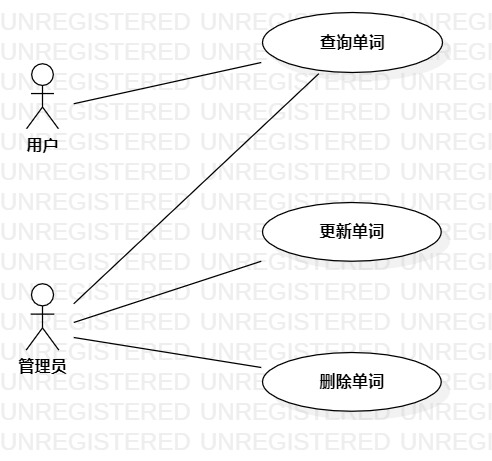

# 实验二

## 一、实验目标

1.学习UML用例图  
2.弄明白用例文档表，一些主要表项的意义  

## 二、实验内容

1.画出自己所选题目的用例图  
2.填写自己的用例文档表  

## 三、实验步骤

1.想清楚自己选择题目的参与者是：用户、管理员  
2.区分参与者的功能  
&ensp;&ensp;&ensp;&ensp;管理员：    
&ensp;&ensp;&ensp;&ensp;&ensp;&ensp;&ensp;&ensp;(1.查询单词  
&ensp;&ensp;&ensp;&ensp;&ensp;&ensp;&ensp;&ensp;(2.更新单词  
&ensp;&ensp;&ensp;&ensp;&ensp;&ensp;&ensp;&ensp;(3.删除单词   
&ensp;&ensp;&ensp;&ensp;用户：  
&ensp;&ensp;&ensp;&ensp;&ensp;&ensp;&ensp;&ensp;(1.查询单词  
3.确定对应功能的页面有主页面，单词页面。  
4.区分参与者的区别：管理员登陆成功后单词页面会多出修改按钮。

## 四、实验结果

1. 画图  
  
图1. StartUML创建用例图  
## 表1：查询用例规约  

用例编号  | UC01 | 备注  
-|:-|-  
用例名称  | 查询  |   
前置条件  |   | *可选*   
后置条件  |      | *可选*   
基本流程  | 1.『管理员』/『用户』在主页面搜索框中输入单词，点击搜索按钮。  |*用例执行成功的步骤*    
~| 2. 系统判断输入非空，查询单词信息。  |   
~| 3.『管理员』/『用户』跳转到该单词的单词页面。  |    
扩展流程  | 2.1. 系统判断输入为空。  |  
~| 2.2. 『管理员』/『用户』跳转到主页面。 |  
## 表2：更新用例规约  

用例编号  | UC02 | 备注  
-|:-|-  
用例名称  | 更新  |   
前置条件  |『管理员』登录成功  | *可选*   
后置条件  |      | *可选*   
基本流程  | 1.『管理员』在该单词页面点击修改按钮。  |*用例执行成功的步骤*    
~| 2. 系统将单词的信息变为可编辑的状态。  |   
~| 3.『管理员』修改信息后，点击上传按钮。  |   
~| 4. 系统判断输入少于100字符，修改单词信息 |   
~| 5.『管理员』重新跳转至该单词页面。  | 
扩展流程  | 4.1. 系统判断输入不少于100字符，提示上传失败。  |*用例执行失败*    
~| 4.2.『管理员』修改信息，点击上传按钮。 |
