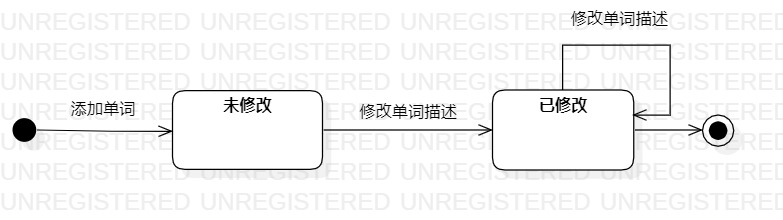

# 实验七：状态建模

## 一、实验目标

1. 掌握对象状态建模（状态图，Statechart）。

2. 掌握UML状态图的画法。 

3. 掌握对象状态的定义与建模方法。 

## 二、实验内容

1. 根据用例模型和类模型，确定功能所涉及的最重要的系统对象。  

2. 画出起点终点。

3. 在状态图上画出对象状态（是形容词）。  

4. 在状态图上画出转变条件。 

## 三、实验步骤

1. 在StarUML画状态图。  

2. 画出起点和终点。  

3. 根据之前所有试验建模确定对象，添加对象的状态未修改、已修改（形容词）。  

4. 根据实验二用例建模，实验三过程建模确定转变条件为添加单词、修改单词描述，只有添加单词后，单词才会存在于系统。  

5. 保存上传

6. 写lab7.md

## 四、实验结果

  
图1：单词状态图
