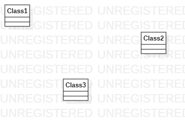

# 实验一

## 一、实验目标

1. 熟悉github

2. 熟悉使用StarUML

3. 确定选题及其部分功能

## 二、实验内容

* 下载建模工具StarUML

*  确认选题要求

*  熟悉工具和平台的使用

## 三、实验步骤

1. 下载StarUML并熟悉使用

2. 确定选题：学生请假小程序 

	* 提出请假申请

	* 修改请假条

	* 查看请假状态

3. 建立第一个UML模型图

4. 使用git上传本地推送到远程仓库中

5. 在GitHub将修改的内容推送到原始代码仓库 

## 四、实验结果

**图1. StarUML图**

**图2. UML图**