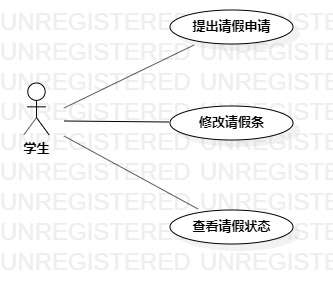

# 实验二：用例建模

## 一、实验目标

1. 掌握用例建模
2. 熟练使用StarUML

## 二、实验内容

1. 确定选题功能
2. 使用StarUML画用例图
3. 编写并提交报告

## 三、实验步骤

1. 确定学生请假小程序功能
   - 提出请假申请
   - 修改请假条
   - 查看请假状态 
2. 确定使用者
   - 学生
3. 使用StarUML画用例图

## 四、实验结果
### 1. 用例图
    

**学生请假小程序用例图**

### 2. 用例规约

#### 表1：提出请假申请 用例规约  

用例编号  | UC01 | 备注  
-|:-|-  
用例名称  | 提出请假申请  |   
前置条件  |  学生已登录    | *可选*   
后置条件  |  系统显示成功提交申请页面    | *可选*   
基本流程  | 1.学生点击我要请假按钮；  |*用例执行成功的步骤*    
~| 2.系统显示申请页面；  |   
~| 3.学生填写请假信息(请假类型、开始日期、请假天数、描述)；  |   
~| 4.学生点击提交申请按钮；  |  
~| 5.系统检查请假信息填写完整；  |
~| 6.系统查询学生帐号信息，检查帐号存在；   |  
~| 7.系统保存请假信息；  |  
~| 8.系统显示成功提交申请页面；   |  
扩展流程  |5.1 请假信息填写不完整，提示“请假信息空缺”，返回第3步；     |*用例执行失败*    
~| 6.1 系统查询学生帐号信息，检查帐号不存在，提示“帐号不存在！”； |
#### 表2：修改请假条 用例规约  

用例编号  | UC02 | 备注  
-|:-|-  
用例名称  | 修改请假条  |   
前置条件  |  学生已登录并且发起过申请    | *可选*   
后置条件  |  系统显示成功修改页面    | *可选*   
基本流程  | 1.学生点击修改申请按钮；  |*用例执行成功的步骤*    
~| 2.系统显示修改页面；  |  
~| 3.学生修改请假信息(请假类型、开始日期、请假天数、描述)；  |   
~| 4.点击修改申请按钮；  |  
~| 5.系统检查请假信息填写完整；  |
~| 6.系统查询学生帐号信息，检查帐号存在；   |  
~| 7.系统修改申请信息，请假状态变更为“待定”，请假申请需重新审批；  |  
~| 8.系统显示成功修改页面；  |  
扩展流程  |5.1 请假信息填写不完整，提示“请假信息空缺”，返回第3步；     |*用例执行失败*    
~| 6.1 系统查询学生帐号信息，检查帐号不存在，提示“帐号不存在！”； |
#### 表3：查看请假状态  用例规约  

用例编号  | UC03 | 备注  
-|:-|-  
用例名称  | 查看请假状态   |   
前置条件  |  学生已登录并且发起过申请    | *可选*   
基本流程  | 1.学生输入请假开始日期； |*用例执行成功的步骤*  
~| 2.学生点击查询按钮； |   
~| 3.系统检查请假开始日期不为空； |
~| 4.系统查询学生帐号信息，检查帐号存在；  | 
~| 5.系统查询学生请假信息存在； |
~| 6.系统绑定修改申请按钮； |
~| 7.系统显示请假信息； |
扩展流程  | 3.1 系统检查开始日期为空，提示“未填写查询日期”，返回第1步；  |*用例执行失败*    
~| 4.1 系统查询学生帐号信息，检查帐号不存在，提示“帐号不存在！”； |
~|5.1 系统查询学生请假信息存在，显示“查无记录”；   |
