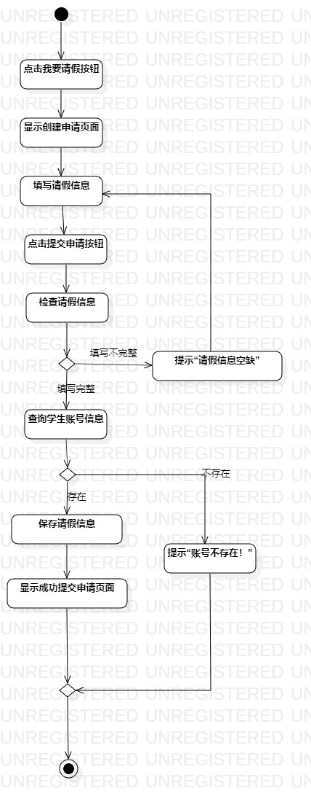
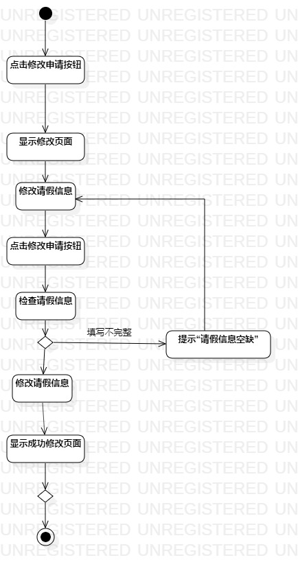
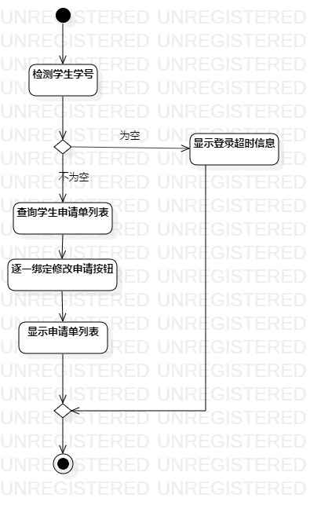

# 实验三：过程建模

## 一、实验目标

1. 掌握过程建模方法
2. 掌握活动图的画法

## 二、实验内容

   根据实验二中的用例规约创建活动图

## 三、实验步骤

1. 熟悉活动图（Activity Diagram）的符号及其用法

   - Initial：初始状态
   - Final：最终状态
   - Decision：判定活动
   - Action：操作
   - Control Flow：控制流
2. 修改用例规约不符合的操作
3. 精炼提出请假申请/修改请假条/查看请假状态活动图操作中的语句
4. 添加Initial和Final
5. 根据用例规约添加Action和Decision
6. 最后用Control Flow将各符号连接

## 四、实验结果

**图1：提出请假申请的活动图**

**图2：修改请假条的活动图**

**图3：查看请假状态的活动图**