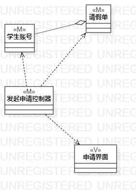
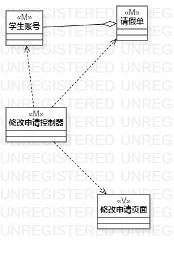
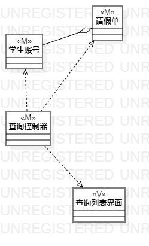

# 实验四：类建模
# 实验五:高级类建模

## 一、实验目标

1. 掌握类建模方法；
2. 了解MVC或你熟悉的设计模式；
3. 掌握类图的画法。（Class Diagram）

## 二、实验内容

   分析MVC设计模式，按照实验用例图设计类图

## 三、实验步骤

1. 学习类建模知识和MVC设计模式
2. 从实验一的3个用例规约中寻找功能中涉及的相关类
3. 分析并确定类间关系
4. 根据分析结果基于MVC模式设计类图
5. 在StarUML中画出类图

## 四、实验结果

**图1：提出请假申请的类图**

**图2：修改请假条的类图**

**图3：查看请假状态的类图**

