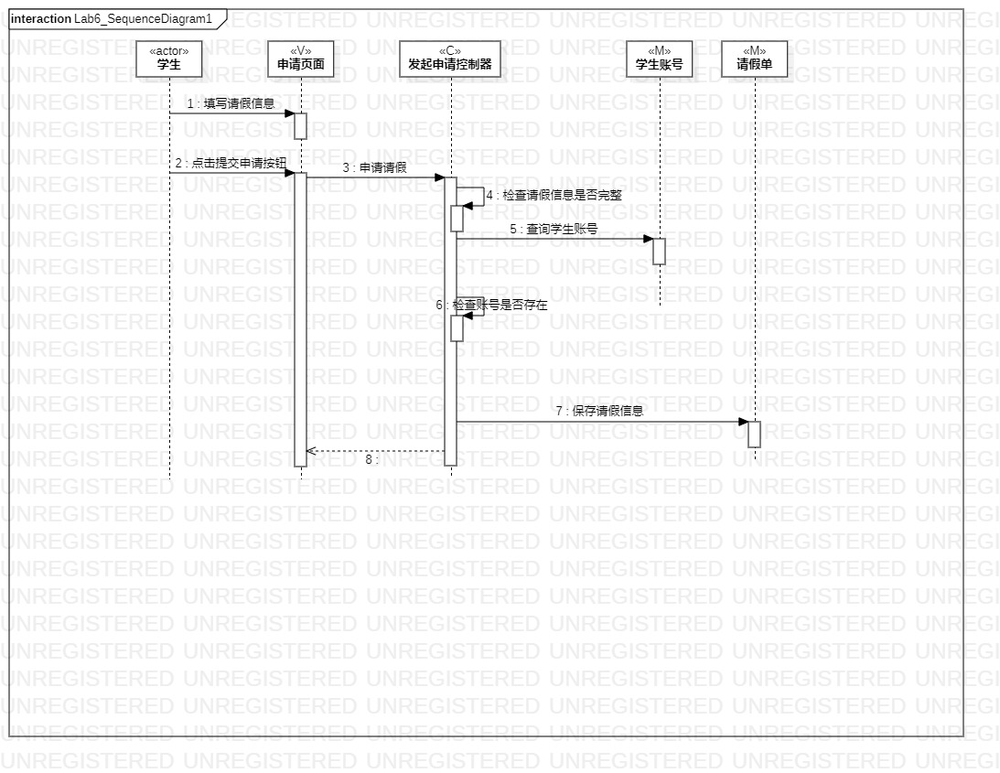
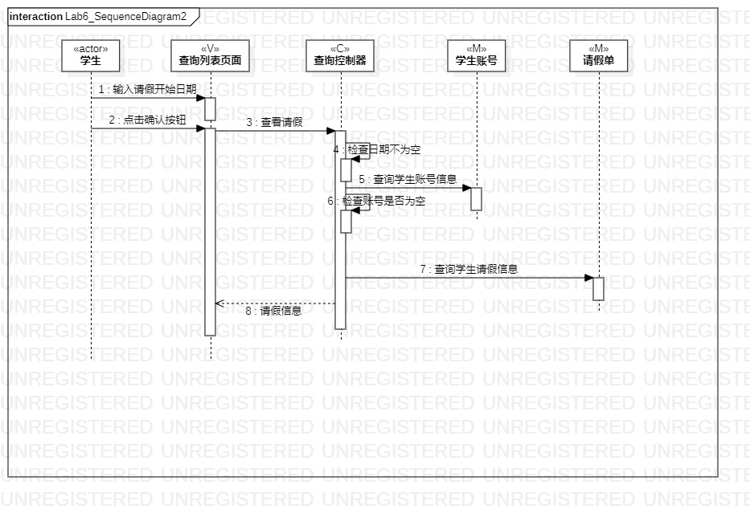
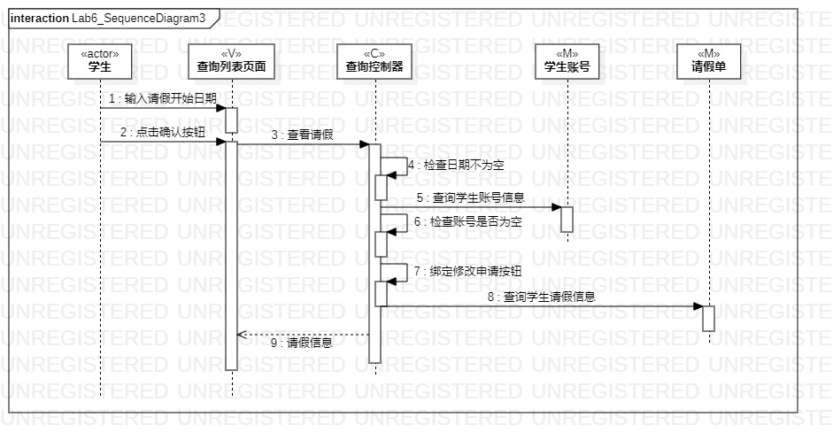

# 实验六：交互建模

## 一、实验目标

1. 理解系统交互；
2. 掌握UML顺序图的画法；
3. 掌握对象交互的定义与建模方法。

## 二、实验内容

1. 根据用例模型和类模型，分析系统涉及的交互关系。

2. 画出顺序图

## 三、实验步骤

1. 从用例图中找到参与者
2. 对比用例规约，找到操作步骤。
3. 找到不合理的操作 ，修改用例规约。
4. 从类图中找出3个参与者，总共4个参与者，修改类图。
5. 活动图中修改操作步骤，确定操作流程。
6. 按照操作流程画出顺序图。

## 四、实验结果

**图1：提出请假申请的顺序图**

**图2：修改请假条的顺序图**

**图3：查看请假状态的顺序图**

