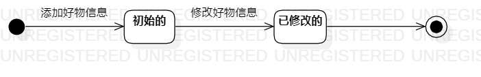

# 实验七：状态建模

## 一、实验目标

1. 了解状态图的相关概念
2. 掌握UML状态图的画法
3. 掌握UML状态图的画法；

## 二、实验内容

1. 学习状态图的相关概念
2. 学习状态图的画法
3. 完成状态建模

## 三、实验步骤

1. 在StarUML中创建状态图

2. 根据选题选择出一个对象：好物

3. 寻找好物的重要状态

4. 确定状态转变的动作

## 四、实验结果

图1 好物