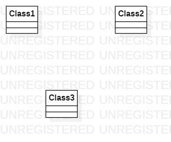

# 实验一

## 一、实验目标

1. 熟悉GitHub实验过程
2. 安装与使用StarUML

## 二、实验内容

1. 安装Git并练习使用Git Bash
2. 安装StarUML并创建一个图

## 三、实验步骤

1. fork项目到自己目录下
2. clone项目到本地
3. 添加自己的目录
4. 使用StarUML创建一个图并保存到目录下
5. push文件到远程库
6. 发送pull request

## 四、实验结果

图1. 在StarUML上建立第一个图