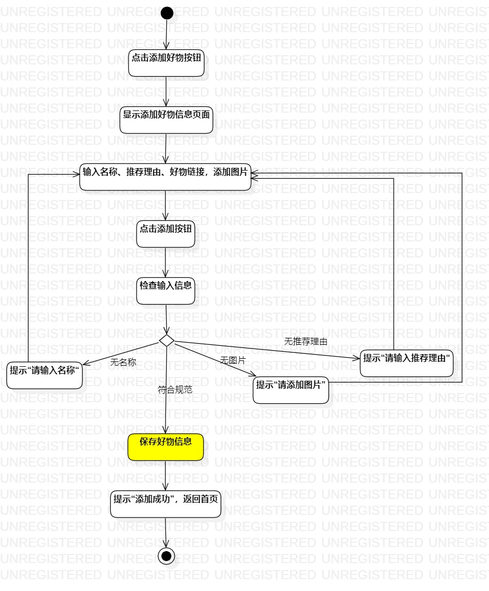
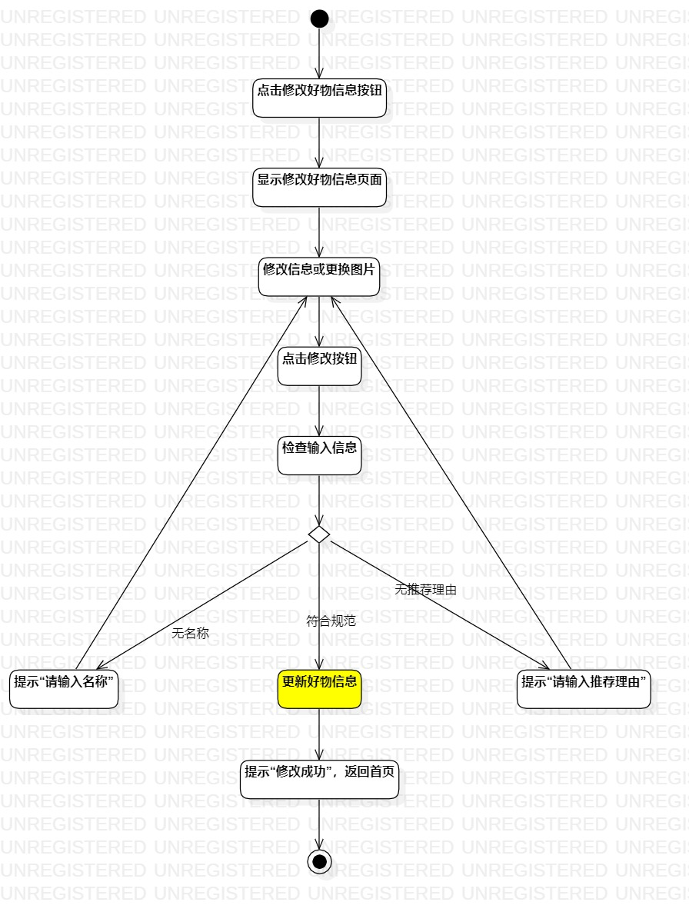

# 实验三：过程建模

## 一、实验目标

1. 掌握过程建模方法
2. 掌握活动图的画法（Activity Diagram）

## 二、实验内容

1. 学习过程建模
2. 使用StarUML完成过程建模

## 三、实验步骤

1. 学习过程建模
2. 使用StarUML完成“添加好物信息”以及“修改好物信息”两个用例的过程建模
   - 添加Initial
   - 依据用例规约，动作为Action
   - 依旧用例规约，有扩展流程的需要使用Decision
   - 过程用Control Flow连接
   - 添加Final
3. 调整各元素，增加过程建模图的可阅读性

## 四、实验结果

图1：添加好物信息活动图

图2：修改好物信息活动图