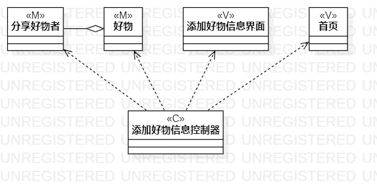
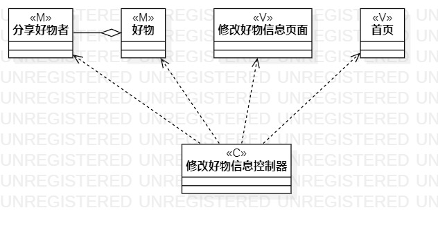

# 实验四:类建模
# 实验五:高级类建模

## 一、实验目标

1. 了解类的概念及组成
2. 了解类之间的关系
3. 了解MVC设计模式
4. 实现类建模

## 二、实验内容

1. 观看视频学习类的概念及组成、类之间的关系、MVC设计模式
2. 使用StarUML完成类建模

## 三、实验步骤

1. 学习类的概念及组成、类之间的关系、MVC设计模式、类图画法
2. 使用StarUML创建两个用例的类图
   - 添加好物信息
   - 修改好物信息
3. 根据用例规约寻找并绘制用例中涉及的类
4. 绘制用例控制器类
5. 确定类间的关系，完成建模

## 四、实验结果

图1 添加好物信息类图

图2 修改好物信息类图