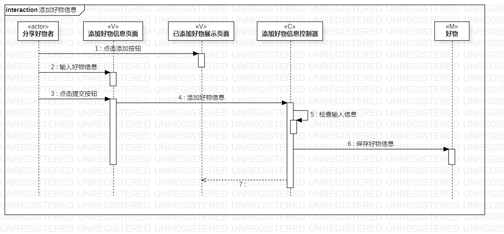
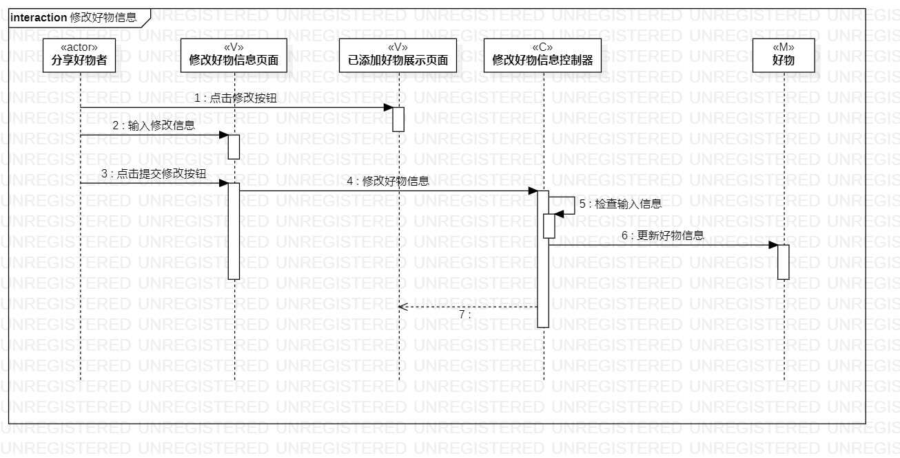

# 实验六: 交互建模
## 一、实验目标
1. 了解顺序图的相关概念

2. 掌握UML顺序图的画法；

## 二、实验内容
1. 学习顺序图的相关概念
2. 学习顺序图的画法
3. 完成交互建模

## 三、实验步骤
1. 在StarUML中创建顺序图
   - 添加好物信息
   - 修改好物信息

2. 根据用例规约寻找参与者

3. 根据类图寻找类

4. 根据活动图绘制消息、存活条和返回消息

## 四、实验结果

图1 添加好物信息顺序图

图2 修改好物信息顺序图