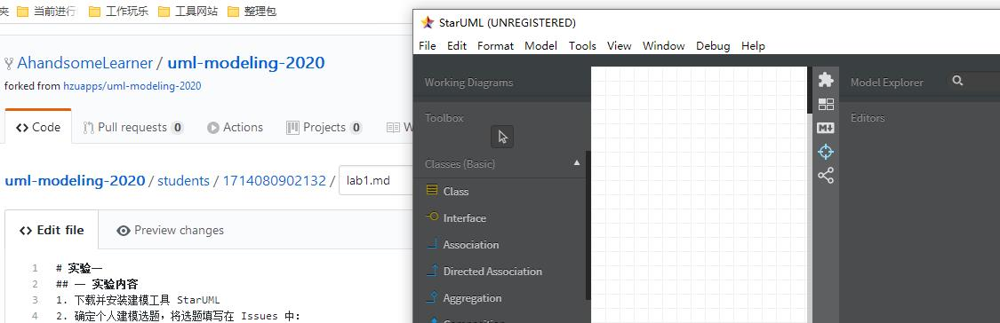
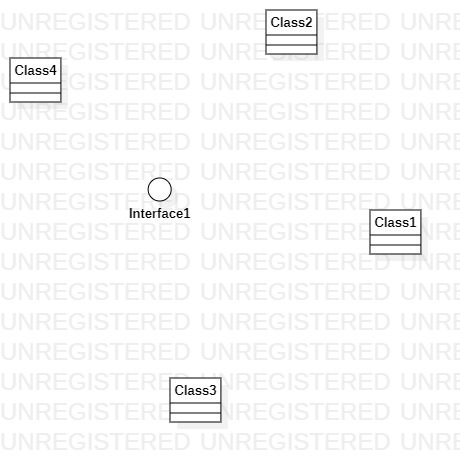
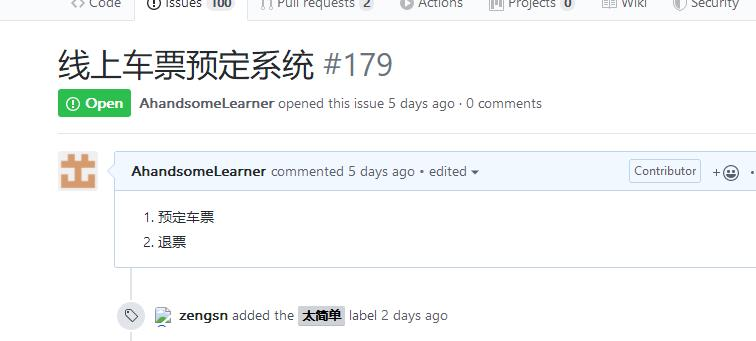

# 实验一：UML建模工具   
## 一 实验目标  
1. 下载安装STARUML；  

2. 初步了解画图；    

## 二 实验内容  
1. 下载并安装建模工具 StarUML；   
   
2. 确定个人建模选题，将选题填写在 Issues 中：  

## 三 实验步骤   
1.工具安装之后，打开并截图，保存在实验报告中；

2. 加入GitHub题库 —— uml-modeling-2020；

3. 将完成的第一个uml图push到GitHub上；  

4. 将个人选题及描述写在实验报告中，具体要求：

## 四 实验结果   
   
图1：软件安装截图

图2：加入题库截图

 
图3：第一个uml图

  
图4：创建issues截图

