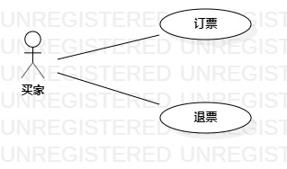

# 实验二：用例建模
## 一 实验目标
1. 创建并完善选题；

2. 了解用例图的画法；

3. 了解用例规约的必备元素和书写方式。

## 二 实验内容
1. 建立自己的选题；

2. 根据选题，在staruml上画出用例图；

3. 书写用例规约。

## 三 实验步骤
1. 确立系统的功能：  
   （1）订票；  
   （2）退票。  

2. 根据用例，建立用例图；  
   （1）确立系统买家；  
   （2）写出用例；  
   （3）建立联系。  

3. 根据用例，书写用例规约。

## 实验结果：
  

图1：线上车票预订系统

## 表1：订票用例规约

 用例编号  | UC01 | 
 -|:-|
 | 用例名称 | 订票 | 
 | 前置条件： | 买家已经登录系统，并查询到符合要求的车票，进入了购票界面。 |
 | 后置条件： | 买家确认购买信息无误，于正确时间线下取票 |
 | 基本流程： | 1. 买家选择坐位，购票数量；|
 ~| 2. 买家输入个人信息；|
 ~| 3. 点击“购票”；|
 ~| 4. 系统检查车票购买数量，确认无误后，占用此车次座位资源；|
 ~| 5. 系统创建一条订单；|
 ~| 6. 系统显示"成功购买车票"。|
 | 扩展流程： | 1.1 系统检查发现购买数量小于1，提示"购买数量错误！"；|
 ~| 1.2 系统检查发现购买数量大于5，提示"超过个人一次性可购买车票数量" 。|

 
## 表2：退票用例规约
 用例编号  | UC012 | 
 -|:-|
 | 用例名称： | 退票 |
 | 前置条件： | 买家已经在本系统上购买了一张车票，且车票未过期，只有未过期的车票才有退票选项 |
 | 后置条件： | 买家成功退票，系统返回购票对应金额 |
 | 基本流程： | 1. 买家点击"退票"按钮; |
 ~| 2. 系统显示退票理由选择界面；|
 ~| 3. 买家选择退票理由；|
 ~| 4. 买家点击“确认退票"按钮；| 
 ~| 5. 系统检查订单信息，发现未超过退票限制时间，则释放此车票被占用的车次座位资源，|
 ~| 6. 系统删除此条订单；|
 ~| 7. 系统显示"退票成功"。 |
 | 扩展流程： | 5.1 系统检查发现已超过指定退票限制时间，提示“已超过退票时间，不允退票”。 |
 
 

