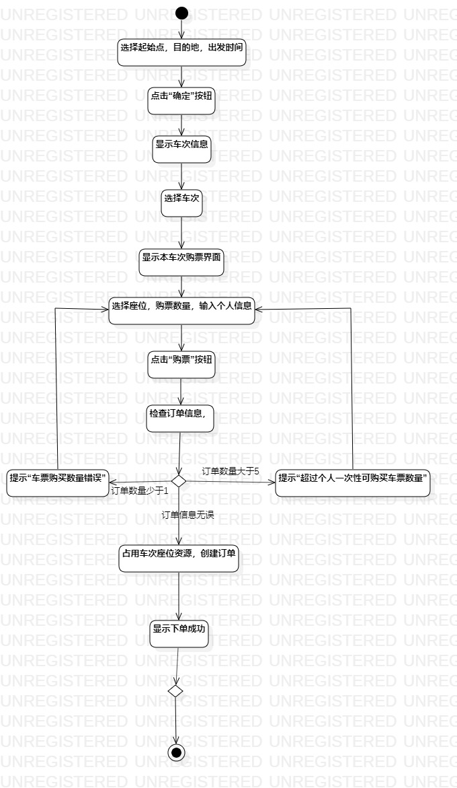
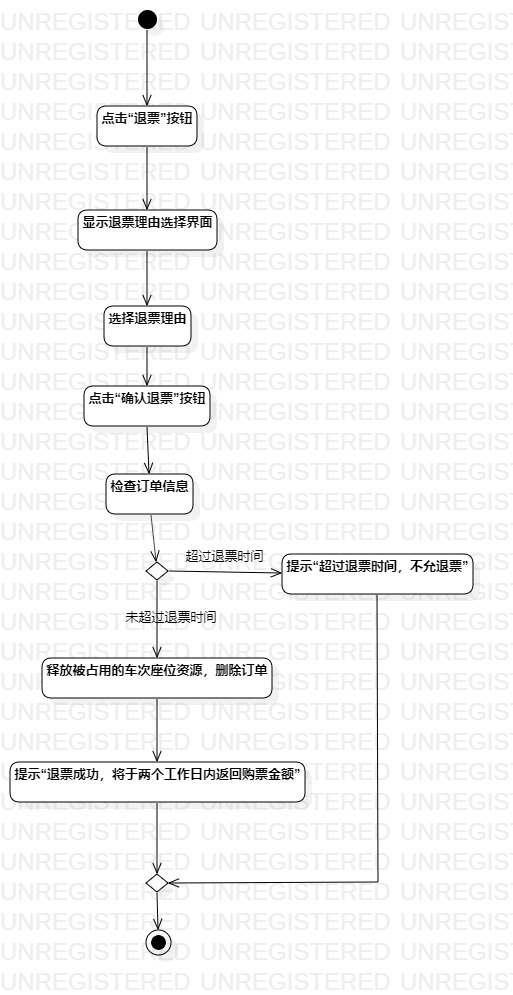

# 实验3：过程建模
## 一 实验目标
 1. 学习了解用例活动图的画法；

 2. 了解如何将用例的流程以活动图的方式表示出来。

## 二 实验内容
 1. 根据选题的用例，在staruml上画出活动图；

 2. 掌握过程建模的方法。

## 三 实验步骤  
 1. 根据“订票”用例，画出活动图：  

   （1） 添加开始与结束符号；  
   （2） 将操作在action元素中表示出来；  
   （3） 添加decisions表示分支（扩展流程）；  
   （4） 添加merge，表示分支结束；  
   （5） 添加flow，描述流程的方向；  
   （6） 根据“订票”用例，正确修改分支的去向。

 2. 根据“退票”用例，画出活动图；  
   与“订票”活动图相同；

 3. 调整活动图的位置，使其工整。

## 实验结果：
  

 图1："订票"活动图

 图2：“退票”活动图
