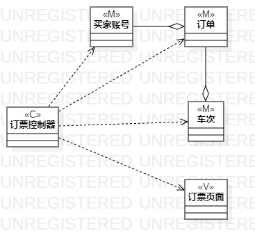
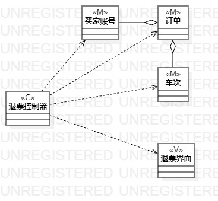

# 实验四，五：类建模
## 一 实验目标
1. 熟悉了解类建模的方法与相关符号的使用；

2. 掌握MVC设计模式实现类建模；

3. 掌握类图的画法。

## 二 实验内容
1. 根据自己的用例，提炼出实体，页面与控制器；  

2. 以MVC设计方式，画出用例的类图；  

## 三 实验步骤
1. 根据实验2所写的用例规约，提炼出“订票”用例的实体，页面与控制器：  
   （1）实体：“买家账号”，“订单”，“车次”；  
   （2）页面：“订票页面”；  
   （3）控制器：“订票控制器”。  

1. 根据实验2所写的用例规约，提炼出“退票”用例的实体，页面与控制器：   
   （1）实体：“买家账号”，“订单”，“车次”；  
   （2）页面：“退票页面”；   
   （3）控制器：“退票控制器”。   

3. 以MVC设计模式，画出“订票”“退票”用例的类图。   

## 实验结果：
  

图1："订票"类图

  

图1："退票"类图

 

 
 

