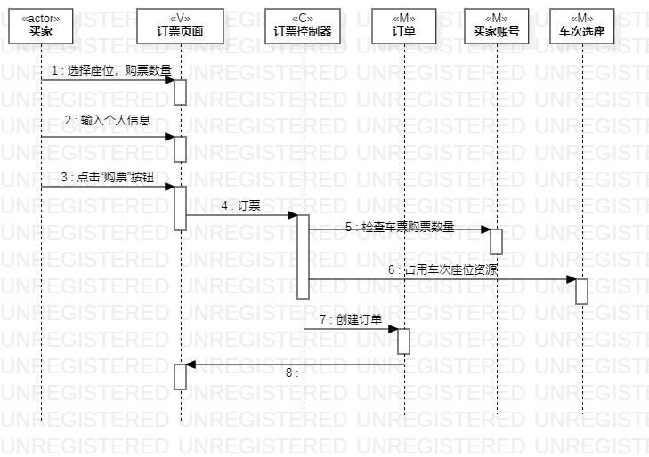

# 实验六：交互建模
## 一 实验目标
1. 熟悉了解交互建模的方法与相关符号的使用；

2. 通过交互建模找出此前的其他实验存在的问题并加以修改；

3. 掌握顺序图的画法。

## 二 实验内容
1. 根据之前的类图，画出actor与各个类；  

2. 根据活动图与用例，完成交互建模；  

## 三 实验步骤
1. 根据“订票“类图与实验3的“订票”活动图，完成订票的交互建模：      
   （1）画出actor，将类图中的各个类按合适的顺序排列在同一行；      
   （2）根据活动图，将各个步骤与各个类串联起来；     
   （3）通过交互建模，发现类图与活动图中存在的问题，并进行修改。     

2. 根据“退票“类图与实验3的“退票”活动图，完成退票的交互建模：          
   （1）画出actor，将类图中的各个类按合适的顺序排列在同一行；          
   （2）根据活动图，将各个步骤与各个类串联起来    ；     
   （3）通过交互建模，发现类图与活动图中存在的问题，并进行修改。     

3. 删除远程仓库中原有的类图与活动图，将修改后的类图与活动图上传，并修改。  

## 实验结果：
  

图1："订票"顺序图

  

图1：“退票”顺序图

 

 
 

