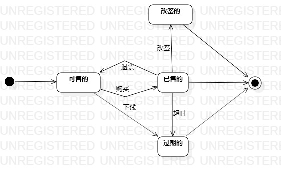

# 实验七：状态建模
## 一 实验目标
1. 熟悉了解状态建模的方法与相关符号的使用；

2. 掌握状态图的画法。

## 二 实验内容
1. 根据用例，提取出关键对象；  

2. 根据本身用例，并推测对象应有的功能，画出状态图。

## 三 实验步骤
1. 根据本身用例，并推测对象应有的功能，画出状态图：      
   （1）提取对象，“订单”；      
   （2）描述状态，“可售的”，“已售的”，“过期的”，“改签的”；     
   （3）连接，写出导致状态变化的操作。       

## 实验结果：
  

图1："订单"状态图

 

 
 

