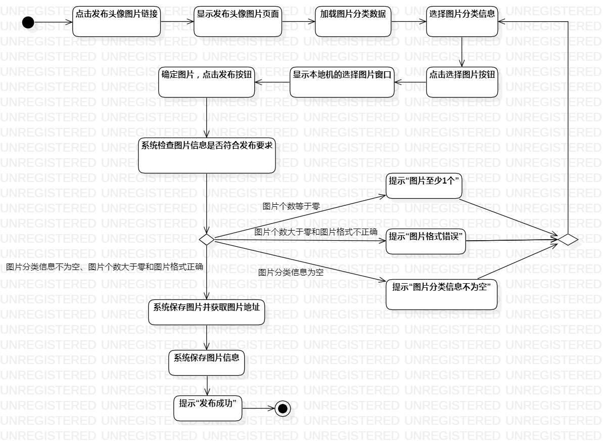
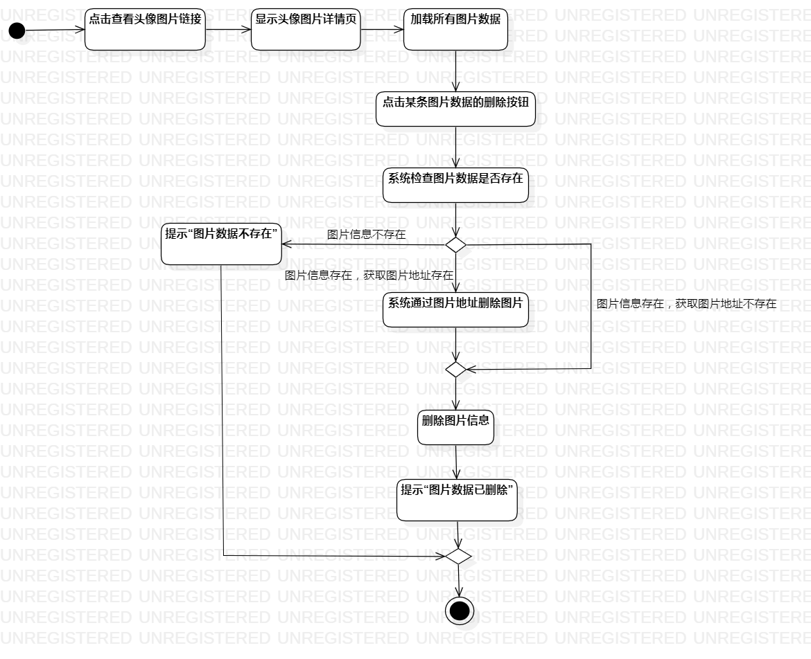
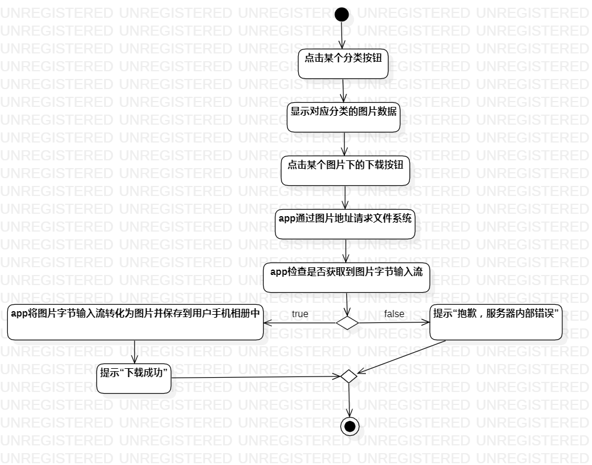

# 实验三：过程建模

## 一、实验目标

1. 掌握过程建模方法；
2. 掌握活动图的画法。

## 二、实验内容

1. 修改实验二部分用例规约；
2. 根据修改的用例规约画出活动图；
3. 编写实验报告。

## 三、实验步骤

1. 理解活动图的符号意义及其用法；
2. 在StarUML创建Activity Diagram；
3. 添加Initial；
4. 根据用例规约添加Action和Decision；
5. 思考用例规约的严谨性，修改用例规约和活动图；
6. 添加Final；
7. 最后用Control Flow将各符号连接；
8. 调节符号之间的间距与比例，美化活动图；
9. 重复2-8，完成全部活动图；
10. 使用Git Bash提交实验报告。

## 四、实验结果

### 发布头像图片活动图

### 删除头像图片活动图

### 下载头像图片活动图

